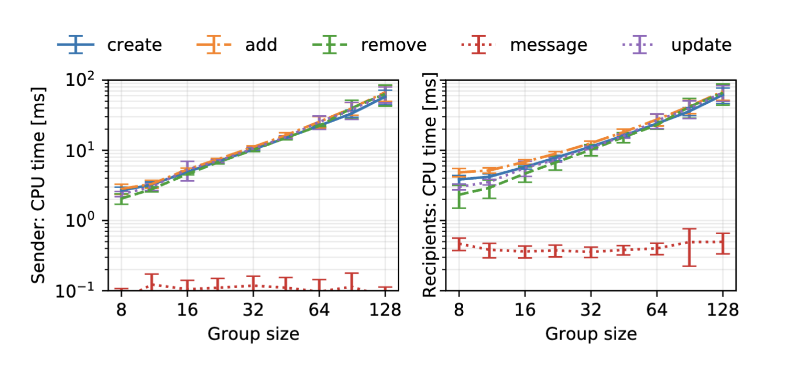

# Analysis of proposed protocols for metadata protection and decentralisation in Secure Group Messaging

**Meri Leeworthy**
**ID: 34659714**

# 1 Publication Details

This report is about two main papers, [[Key Agreement for Decentralized Secure Group Messaging with Strong Security Guarantees]] by Wiedner et al. [1] and [[How to Hide MetaData in MLS-Like Secure Group Messaging - Simple, Modular, and Post-Quantum]] by Hashimoto et al. [2].

Wiedner *et al*. [1] is published in "Proceedings of the 2021 ACM SIGSAC Conference on Computer and Communications Security (CCS ’21)", pages 2024-2045. Hashimoto *et al*. [2] was published in the proceedings of the same conference in 2022, and can be found on pages 1399–1412.

# 2 Introduction

In recent decades, developments in the field of *secure messaging* (SM) have enabled a proliferation in the use of end-to-end encrypted messaging applications, successfully bringing new privacy standards to the mainstream. As the field is fairly complex, this introduction attempts to provide an outline of the many considerations that give context to recent research. 

## Secure messaging

PGP, introduced in 1991 and later standardised as OpenPGP, offered a confidentiality, integrity and authentication layer on top of existing transport services like email, on the basis of identifying users with long-lasting public keys. In PGP, if a user's corresponding private key is compromised, all past and future messages can be decrypted by the attacker. Off-the-record (OTR), introduced in 2004 for instant messaging applications, demonstrated a system for *forward secrecy* (FS), where each new messaging session used an ephemeral Diffie-Helman key exchange to generate new session keys, which would be deleted when the session ends. This system was limited to synchronous sessions, where both users are online for the session key exchange.

The Signal protocol [3], also known as the 'Double Ratchet' protocol, has been widely influential since it was introduced in 2013, and expands on the features introduced by OTR - most importantly in enabling asynchronous communication. Signal's approach to FS was per-message, rather than per session, and once the session had been established did not require interactive key exchange. Asynchronously initialising a session with a shared secret is achieved using a server to store what are called 'pre-keys' in the Extended Triple Diffie-Helman (X3DH) protocol [4], which was created alongside the Signal protocol. FS is achieved through the so-called 'symmetric ratchet' mechanism, in which new keys are deterministically, pseudorandomly generated in parallel by both sender and receiver for symmetrically encrypting and decrypting each new message, and deleted once used. Signal sessions can also be very long-lasting, in contrast to OTR, which introduces a risk that an undetected time-bound compromise could continue with access to the correct ratchet keys indefinitely after a device's keys are leaked. This is addressed by introducing a feature which later became known as *post-compromise security* (PCS), which periodically re-initialises the symmetric ratchets with a new shared 'update secret' output from a 'Diffie-Helman ratchet'. The specific state of this shared update secret is known as an 'epoch', and in Signal it changes (i.e. the Diffie-Helman ratchet is advanced) every time a user takes a turn sending messages. 

Subsequent analysis of the Signal protocol has undertaken to generalise and modularise its components as cryptographic primitives with specific properties [5]. The Diffie-Helman ratchet is described as an implementation of a *continuous key agreement* (CKA) primitive. The symmetric encryption ratchet is an implementation of *forward-secure authenticated encryption with associated data* (FS-AEAD).[^1] The third core primitive of the protocol is a function that is both a pseudorandom function and a pseudorandom number generator, a PRF-PRNG, which for each advance in the CKA epoch, generates new keys to update sending and receiving FS-AEAD epochs [5].

## Secure group messaging

Like PGP and OTR, the Signal protocol was designed for secure two-party communication, and its adaptation for use in group messaging applications like Signal, WhatsApp and Element has been approached in various ways, each with benefits and drawbacks in terms of performance and security. Signal, for example, effectively implements group messaging in a group of $n$ users through establishing a complete graph of pairwise Signal protocol sessions, leading to $n^2$ complexity and network traffic for every message sent and received. This simple solution retains all the security properties of the two-party Signal protocol, at the expense of performance. However, consistent demand for *secure group messaging* (SGM) applications in which groups can scale up to tens or hundreds of thousands of members led to the creation of an Internet Engineering Task Force (IETF) working group toward the development of the Messaging Layer Security (MLS) protocol [6], which was published as a standard in 2023. The MLS approach applies recent research to provide a new solution to the group messaging problem with properties that make it viable for adoption as a standard.

The majority of this research has focused on the *TreeKEM* protocol [14], which is the multi-party equivalent to Signal protocol's Diffie-Helman ratchet (or more generally, the CKA component) in MLS, in that the purpose is to negotiate update secrets shared between all group members for achieving PCS. Subsequent analysis has formalised the general properties of such a protocol as *continuous group key agreement* (CGKA), which is used in conjunction with a PRF-PRNG and a multi-party equivalent to FS-AEAD (forward secure group-AEAD or FS-GAEAD [8]) to provide a full SGM protocol [7]. As well as operating asynchronously and being resilient to device compromise, CGKAs must support dynamic groups in which members can be added or removed at any time [1, s1]. 

## Central server attacks

In general, SGM protocols are designed to provide security against a central server, which may be modelled as a passive adversary. Central servers have long been an essential component in messaging applications for the past few decades, primarily due to their role in ensuring high availability and data consistency, enabling asynchronous communication even when user devices are offline.[^2] While Transport Layer Security (TLS) effectively secures connections between devices and servers, data is decrypted and processed on the server side. End-to-end encryption protocols such as MLS attempt to mitigate threats from adversaries with access to the server, but these mitigations are often constrained by the functional role that servers play in supporting the messaging infrastructure.

SGM protocols commonly assume that servers require significant access to message metadata and must reliably deliver messages without reordering. These assumptions introduce critical vulnerabilities, including risks of traffic analysis, metadata correlation, message reordering attacks, and issues stemming from server centralisation or malfeasance. Such vulnerabilities can expose communication patterns, disrupt usability, and create single points of failure. The two papers reviewed in this report propose methods to address some of these unresolved threats.

Finally, an additional area of research in SGM is in providing active *insider security* against malicious group members from permanently corrupting the state of the session, for example by sending malformed control messages (control messages are explained in section 3). Given that a key affordance of the optimisations introduced by CGKAs is that messaging groups can efficiently scale to tens or hundreds of thousands of users, the likelihood of malicious users is accordingly increased as a serious concern. This report does not address this area of research in detail, but it is worth noting that this is a related and concurrently active area of investigation.
# 3 Brief Summary

*CGKA*

Because SGM protocols are widely recognised to be substantially complex, Weidner et al. [1] and Hashimoto et al. [2] both roughly follow the modularisation in which the protocol is broken down into FS-GAEAD, PRF-PRNG and CGKA [7, 8], and both limit the scope of their work to focus on the latter component while acknowledging that further research is needed to address the security properties of the SGM protocol as a whole. The CGKA is informally recognised as the 'essence' of an SGM protocol, in that the shared group secret it provides is an essential prerequisite for secure messaging. For these group secrets, the CGKA is required to provide *confidentiality*, *integrity* and *authentication*, as well as *forward-secrecy* and *post-compromise security*. 

Briefly, a continuous group key-agreement (CGKA) protocol, as defined in [7], is made up of six algorithms:

> - **Initialization**: `init` takes an ID $ID$ and outputs an initial state γ. 
> - **Group creation**: `create` takes a state $γ$, a list of IDs $G = (ID_1, . . . , ID_n)$, and outputs a new state $γ^′$ and a control message $W$. 
> - **Add**: `add` takes a state $γ$ an ID $ID^′$, and outputs a new state γ as well as control messages $W$ and $T$. 
> - **Remove**: `rem` takes a state $γ$ and an ID $ID^′$ and outputs a new state $γ^′$ and a control message $T$. 
> - **Update**: `upd` takes a state $γ$ and outputs a new state $γ^′$ and a control message $T$. 
> - **Process**: `proc` takes a state $γ$ and a control message $T$ and outputs a new state $γ^′$ and an update secret $I$.
> [7]

Once a group is created, any group member can **add** or **remove** members or perform **updates** against their local state. Each of these three algorithms outputs a control message $T$ (or $W$ for 'welcoming' new members) which can be asynchronously sent to all other group members. The other members must then **process** the control message to advance the *epoch* (keeping their state synchronised with the group), and to generate a new update secret in the case of updates. The requirements for a CGKA are as follows: each update epoch is required to generate the same update secret for each member (correctness), and it must be indistinguishable from randomness (privacy). In the event of a compromise, all update secrets prior to the current one must be hidden to the attacker (forward secrecy), and after the compromise, once every member performs an update, update secrets must become secret again (post-compromise security) [7].

Wiedner et al. [1] adapts and generalises the CGKA protocol to define *decentralised* continuous group key agreement, or DCGKA. The adapted primitive is designed such that there is no requirement that all traffic is routed through and processed by a central server, making federated or peer-to-peer key agreement possible. As well as meeting the requirements given above for CGKAs, their design also provides _eventual consistency_, ensuring that despite network delays or disruptions, all members of the group will eventually agree on the same group state. The crux of decentralisation in this context is in defining correct behaviours when group members are added or removed concurrent to each other or group key updates, such that the security properties of the protocol are preserved.

By contrast, Hashimoto et al. [2] retain the central server, but present a *wrapper* protocol $W^{mh}$ around CGKA with metadata-hiding properties. While the CGKA provides all the same guarantees, $W^{mh}$ is constructed with additional requirements: group members, and only *authenticated* group members, can *anonymously upload* and *download* proposals and commits to and from the server; further, multiple uploads and downloads by the same member are *unlinkable* - the server cannot determine that the same person performed them. Members can also *selectively* download partial commits while retaining total anonymity. Finally, the wrapper protocol inherits the *compromise resilience* (FS and PCS) guarantees from underlying the CGKA. The authors show that this construction enables security for metadata that is both *static* (e.g. explicit facts about user identity) and *dynamic* (e.g. facts about users implied from access patterns).[^3]

*Security models*

Given the mandate for SGM protocols to enable performant group messaging for very large groups (up to 50,000 members in MLS [6]), the majority of designs for CGKAs have depended on somewhat relaxed security requirements, particularly in modelling the server as a passive adversary that will honestly follow the protocol, also known as *honest but curious*. Alwen et al. in [9] shows that many CGKA designs are based on what they call a *no-splitting assumption* (NSA), in which concurrent changes to the group state are required to be consistently resolved by the server. The server is thereby in a position to split the group state without the group members knowing, which could be exploited in various ways. Like Alwen et al. [9], Weidner et al. [1] model servers (if used) as active adversaries, which may arbitrarily disrupt network traffic. However, group members are assumed to correctly follow the protocol, limiting insider security.

The idealised CGKA component which Hashimoto et al. [2] build on follows the model of [10, 11] in which the server is an active adversary which can tamper with or inject messages, and in which group members can be malicious insiders who can invite other malicious members to the group (including the server) and split the group state. This idealised CGKA will still produce group secret keys indistinguishable from randomness despite such conditions. For their wrapper protocol $W^{mh}$, they do model the situation in which the server is corrupted, but the metadata-hiding properties of their approach are only guaranteed when the server is honestly following the protocol. In this sense the authors make use of different security models for different layers of their protocol. 

*Contributions*

Weidner et al. [1] make several contributions to the field of secure group messaging by defining and implementing decentralised continuous group key agreement (DCGKA). First, they formally define the (idealised) concept of DCGKA, extending traditional continuous group key agreement protocols to function without reliance on a centralised server. Second, they design and implement a practical protocol that realises DCGKA, demonstrating how the theoretical model can be applied in real-world scenarios. Finally, the authors conduct a performance evaluation of their implementation. They show that despite the increased complexity of decentralisation, the protocol achieves reasonable performance, making it a viable option for large-scale secure group messaging systems.

Hashimoto et al. [2] contribute a series of advances that enhance the theoretical and practical understanding of metadata-hiding CGKA protocols. They make use of the *universal composability* (UC) security framework, first introduced in [12] to ensure that protocols remain secure when combined with other protocols. Hashimoto et al. [2] contribute to work that applies this framework to the SGM context such as [10, 11] to formally model the properties of a protocol that can secure both static and dynamic metadata. They prove that a variant of the *Chained CmPKE* algorithm introduced by Hashimoto et al. [11] can realise their UC model of static metadata-hiding CGKA, $F^{ctxt}_{CGKA}$. As mentioned above, they also provide a wrapper protocol $W^{mh}$, which UC-realises their model of CGKA that hides static and dynamic metadata, $F^{mh}_{CGKA}$, and they analyse its efficiency. Finally, they define a leakage function describing inherent metadata that cannot be hidden, and use this to study the metadata leakage of various CGKAs.

*Methods*

Weidner et al. [1] use game-based analysis to formally define the security properties of their DCGKA protocol. Specifically, they define a key indistinguishability game wherein the adversary can try to guess update secrets. Their proof is generally by hybrid argument, in which a sequence of 'hybrid distributions' are shown to be computationally indistinguishable by rigorous mathematical argument [13]. In this case, the sequence is the output of the modified security game they describe, with progressively more of the queries outputting random values. They also make use of reduction to the security of 2-party Secure Messaging (2SM) for some aspects of their protocol. 

For simplicity, the HMAC-based Key Derivation Function (HKDF, the practical realisation of the PRF-PRNG mentioned above) is modelled as a random oracle. As members repeatedly apply their (unknown) secrets to the HKDF function, a more detailed hybrid argument is used to show that the resulting 'tree' of outputs is indistinguishable on the entire sequence wherein the input secrets are replaced with random values. By calculating the bounded advantage for each of the components of the protocol they are able to show that the probability of an attacker guessing the secret is negligible.

To analyse performance, the authors first present an asymptotic analysis of the algorithms, with various suggested optimisations. They then present an implementation in Java and take empirical measurements of this implementation in operation to show that the protocol can be reasonably performant. Some of these measurements are visualised below in Figure 1.

*Figure 1: Single core CPU time to execute an operation, per sender or recipient, for groups ranging from 8 to 128 members. Error bars show the standard deviation over 25 independent executions. [1]*

Hashimoto et al. [2] take a different approach to proving the security properties of their approach to hiding metadata. Instead of relying primarily on the hybrid argument[^4], they follow the universal composability (UC) approach, which provides a framework for constructing protocols that remain secure even under concurrent execution with other protocols. This approach allows protocols to be built from modular components with proven security properties. Canetti's _universal composition theorem_ [20] establishes the conditions under which the security of these components is preserved when composed together to form more complex protocols. 

The security of the primitive components is proven by constructing a _simulator_ that interacts with an ideal functionality representing the primitive, ensuring that the adversary's view in the real protocol can be replicated using only the ideal functionality. In the _G-hybrid model_, where G represents an idealised functionality for a specific task, each invocation of G can later be replaced by a real-world protocol that 'UC-realizes' G. The universal composition theorem guarantees that this replacement maintains the overall security of the composed protocol, ensuring metadata hiding is preserved even in adversarial settings. 

Thus the authors define protocols for CGKA systems at different levels of metadata protection that realise their formally defined ideal models $F^{ctxt}_{CGKA}$ and $F^{mh}_{CGKA}$, and prove that these realised protocols are composed of clearly defined components, the outputs of which are indistinguishable from the ideal protocol by the construction of a simulator. 

Their study of the performance of metadata-hiding CGKA is relatively brief, focused on the concrete overheads in message size introduced by various schemes for the three main cryptographic primitives their protocol makes use of: signatures, multi-recipient public key encryption (mPKE) and symmetric encryption, pseudo-random function and pseudo-random permutation. The ultimate impact on bandwidth is different for each of the operations update, add, remove, commit, process and for application messages, at most increasing the cost for each operation at a rate of between 39-100%, which the authors consider reasonable. 

*Limitations*

The DGGKA protocol introduced by Weidner et al. [1] is limited in a few key areas, most significantly in efficiency, insider security, and metadata privacy. Update and group membership changes incur a message cost of O(n), compared to O(log(n)) in MLS/TreeKEM. It is therefore not practical to apply the protocol for groups of the very large sizes permitted by MLS. Moreover, group members may cause denial of service by sending malformed protocol messages that make group members disagree on keys. Metadata protection is weaker than MLS provides where the *PrivateMessage* type protocol message is used[^5], revealing information such as the identity of users being added to groups to servers in plaintext.

Hashimoto et al. [2], working with considerably less restrictions, provide more thorough guarantees about their metadata-hiding CGKA. However, they do note that metadata out of the scope of their models including access timing and device fingerprinting may be used to circumvent some of those privacy guarantees. As noted earlier, their dynamic metadata privacy model is only realised when the server honestly follows the protocol.

Finally, both Weidner et al. [1] and Hashimoto et al. [2] focus only on the continuous group group key agreement (CGKA) component of SGM protocols, and do not provide security models that capture the entire SGM. 
# 4 Discussion

Considering together the contributions of both Weidner et al. [1] and Hashimoto et al. [2], it is apparent that the security of group messaging, with all the requirements made standard in messaging since the Signal protocol [3], is an extraordinarily complex field of research in which concurrent developments can be based on significantly different assumptions. Now that the Messaging Layer Security [6] standard has been published as an RFC, the imperative for the research community to converge on highly generic approaches is perhaps slightly reduced, giving space for attention to more specific security models that require specialised approaches. The work of Hashimoto et al. [2] which in turn builds on earlier work by Hashimoto et al. [11], highlights a focus on state-of-the-art security guarantees that are highly performant for groups up to a couple hundred[^6].  Weidner et al. [1] similarly renounce the need for very large groups, preferring to enable partition-tolerance for groups of a similar size. 

Interestingly, Weidner et al. [1] imply a tradeoff between decentralisation and metadata privacy. The decentralised Matrix SGM protocol referenced in the paper is also noted for offering less metadata protections due to the necessary role it plays in routing messages in a decentralised network. On the other hand, decentralised networks and particularly peer-to-peer networks intuitively may in some cases offer superior metadata privacy than centralised systems simply by nature of the decreased reliance on a central third party who is inherently positioned to collect significant metadata about its service users. At the extreme, an isolated mesh network in which users internally communicate without any data leaking outside the network offers optimal security against external adversaries even without the use of a secure messaging protocol. An interesting potential direction for future research is in modelling the metadata security of secure group messaging protocols parametrised over the network topology, and defining heuristics for estimating the leakage over that topology. These could potentially form the basis of adaptive security protocols in which the use of potentially expensive cryptographic measures can be dynamically negotiated in response to a variety of network conditions.
# 5 Conclusion

In this report, we have examined the key contributions of two significant papers on secure group messaging (SGM): Wiedner *et al*. [1] and Hashimoto _et al._ [2]. These works address the critical challenges of decentralisation and metadata privacy in continuous group key agreement (CGKA) protocols, underscoring the ongoing complexity of achieving robust security guarantees in SGM.

Wiedner _et al._ [1] introduce the concept of decentralised CGKA (DCGKA), enabling secure group messaging without a reliance on central servers. Their protocol achieves eventual consistency and preserves security properties like forward secrecy (FS) and post-compromise security (PCS) in a decentralised context. However, the trade-offs in efficiency, insider security, and metadata protection limit its scalability to large groups. Despite these constraints, their work represents a significant step toward decentralised and partition-tolerant secure messaging systems.

Hashimoto _et al._ [2] focus on enhancing metadata privacy in CGKA with their wrapper protocol $W^{mh}$. Their approach retains central server-based architecture but introduces anonymity, unlinkability, and selective download capabilities, offering protection for both static and dynamic metadata. While their solution relies on honest server behaviour for certain guarantees, it provides strong resilience against metadata exposure within the defined security models.

Together, these papers highlight the dual priorities in the evolution of SGM: decentralisation for increased resilience against central server failures and metadata privacy to protect users from traffic analysis and adversarial metadata correlation. The trade-offs between decentralisation and metadata protection suggest that future research could benefit from more nuanced models that consider network topology as a variable in security guarantees.

Ultimately, while both approaches advance our understanding of CGKA, they also underscore the need for holistic security models that capture the entire SGM ecosystem, integrating CGKA with FS-AEAD, PRF-PRNG, and comprehensive security considerations. As the field moves forward, exploring adaptive security protocols that dynamically balance decentralisation, efficiency, and metadata privacy will be crucial for building scalable and resilient secure group messaging systems.

# 6 References

**Alwen, J, Coretti, S and Dodis, Y** (2019) ‘The double ratchet: Security notions, proofs, and modularization for the Signal protocol’, _EUROCRYPT 2019, Part I_, 11476:129–158, https://doi.org/10.1007/978-3-030-17653-2_5

**Alwen, J, Coretti, S, Dodis, Y and Tselekounis, Y** (2021) ‘Modular design of secure group messaging protocols and the security of MLS’, _ACM CCS 2021_, 1463–1483, [https://doi.org/10.1145/3460120.3484820](https://doi.org/10.1145/3460120.3484820)

**Alwen, J, Coretti, S, Jost, D and Mularczyk, M** (2020) ‘Continuous group key agreement with active security’, _TCC 2020, Part II_, 12551:261–290, [https://doi.org/10.1007/978-3-030-64378-2_10](https://doi.org/10.1007/978-3-030-64378-2_10)

**Alwen, J, Jost, D and Mularczyk, M** (2022) ‘On the insider security of MLS’, _CRYPTO 2022, Part II_, 13508:34–68, [https://doi.org/10.1007/978-3-031-15979-4_2](https://doi.org/10.1007/978-3-031-15979-4_2)

**Bhargavan, K, Barnes, R and Rescorla, E** (2018) ‘TreeKEM: Asynchronous decentralized key management for large dynamic groups’, _Messaging Layer Security_ mailing list, [https://mailarchive.ietf.org/arch/msg/mls/v1CY0jFAOVOHokB4DtNqS__tX1o](https://mailarchive.ietf.org/arch/msg/mls/v1CY0jFAOVOHokB4DtNqS__tX1o)

**Canetti, R** (2001) ‘Universally composable security: A new paradigm for cryptographic protocols’, _42nd Annual Symposium on Foundations of Computer Science (FOCS 2001)_, 136–145, [https://doi.org/10.1109/SFCS.2001.959888](https://doi.org/10.1109/SFCS.2001.959888)

**Fischlin, M and Mittelbach, A** (2021) ‘An overview of the hybrid argument’, in _The theory of hash functions and random oracles: An approach to modern cryptography_, [https://api.semanticscholar.org/CorpusID:231672387](https://api.semanticscholar.org/CorpusID:231672387)

**Hashimoto, K, Katsumata, S, Postlethwaite, E, Prest, T and Westerbaan, B** (2021) ‘A concrete treatment of efficient continuous group key agreement via multi-recipient PKEs’, _ACM CCS 2021_, 1441–1462, [https://doi.org/10.1145/3460120.3484817](https://doi.org/10.1145/3460120.3484817)

**Marlinspike, M and Perrin, T** (2013) _The double ratchet algorithm_, Open Whisper Systems, https://signal.org/docs/specifications/doubleratchet/

**Marlinspike, M and Perrin, T** (2016) _The X3DH key agreement protocol_, Open Whisper Systems, https://signal.org/docs/specifications/x3dh/

**Wiedner, C** _Key agreement for decentralized secure group messaging with strong security guarantees_. (Details unavailable)

**Hashimoto, K** _How to hide metadata in MLS-like secure group messaging: Simple, modular, and post-quantum_. (Details unavailable)

**MLS Working Group** (2023) _RFC 9420: The messaging layer security (MLS) protocol_, Internet Engineering Task Force, https://www.rfc-editor.org/info/rfc9420

**Alwen, J, Coretti, S, Dodis, Y and Tselekounis, Y** (2021) ‘Security analysis and improvements for the IETF MLS standard for group messaging’. (Details unavailable)

1. Wiedner [[Key Agreement for Decentralized Secure Group Messaging with Strong Security Guarantees]]
2. Hashimoto [[How to Hide MetaData in MLS-Like Secure Group Messaging - Simple, Modular, and Post-Quantum]]
3. Marlinspike [[The Double Ratchet Algorithm]]
4. Marlinspike [[The X3DH Key Agreement Protocol]]
5. Alwen, J., Coretti, S., Dodis, Y.: [[The Double Ratchet - Security Notions, Proofs, and Modularization for the Signal Protocol|The Double Ratchet: Security Notions, Proofs, and Modularization for the Signal Protocol]]. In: Ishai, Y., Rijmen, V. (eds.) EURO- CRYPT 2019, Part I. LNCS, vol. 11476, pp. 129–158. Springer, Cham (2019). https://doi.org/10.1007/978-3-030-17653-2 5
6. MLS [[RFC 9420 - The Messaging Layer Security (MLS) Protocol]]
7. [[Security Analysis and Improvements for the IETF MLS Standard for Group Messaging]]
8. Joël Alwen, Sandro Coretti, Yevgeniy Dodis, and Yiannis Tselekounis. 2021. [[Modular Design of Secure Group Messaging Protocols and the Security of MLS]]. In ACM CCS 2021, Giovanni Vigna and Elaine Shi (Eds.). ACM Press, 1463–1483. https://doi.org/10.1145/3460120.3484820 
9. Joël Alwen, Sandro Coretti, Daniel Jost, and Marta Mularczyk. 2020. [[Continuous Group Key Agreement with Active Security]]. In TCC 2020, Part II (LNCS, Vol. 12551), Rafael Pass and Krzysztof Pietrzak (Eds.). Springer, Heidelberg, 261–290. https://doi.org/10.1007/978-3-030-64378-2_10 
10. Joël Alwen, Daniel Jost, and Marta Mularczyk. 2022. [[On the Insider Security of MLS]]. In CRYPTO 2022, Part II (LNCS). Springer, Heidelberg, 34–68. https://doi.org/10.1007/978-3-031-15979-4_2 
11. Keitaro Hashimoto, Shuichi Katsumata, Eamonn Postlethwaite, Thomas Prest, and Bas Westerbaan. 2021. [[A Concrete Treatment of Efficient Continuous Group Key Agreement via Multi-Recipient PKEs]]. In ACM CCS 2021, Giovanni Vigna and Elaine Shi (Eds.). ACM Press, 1441–1462. https://doi.org/10.1145/3460120.3484817 
12. Canetti, R.: Universally composable security: a new paradigm for cryptographic protocols. In: 42nd FOCS, pp. 136–145. IEEE Computer Society Press, October 2001. https://doi.org/10.1109/SFCS.2001.959888
13. Fischlin, M. and Mittelbach, A. (2021) ‘An Overview of the Hybrid Argument An Excerpt From: The Theory of Hash Functions and Random Oracles—An Approach to Modern Cryptography’, in. Available at: https://api.semanticscholar.org/CorpusID:231672387.
14. Karthikeyan Bhargavan, Richard Barnes, and Eric Rescorla. 2018. [[TreeKEM - Asynchronous Decentralized Key Management for Large Dynamic Groups|TreeKEM: Asynchronous Decentralized Key Management for Large Dynamic Groups]]. Messaging Layer Security mailing list. https://mailarchive.ietf.org/arch/msg/mls/v1CY0jFAOVOHokB4DtNqS__tX1o 

[^1]: 'Forward secure' is synonymous with 'forward secret'.
[^2]: The MLS terminology for this infrastructural dependency is *delivery service*, regardless of whether it is centralised.
[^3]: Some kinds of dynamic metadata, such as access timing and user geolocation, are not considered in this work. My intuition here is that these may be somewhat outside of the scope of what an SGM protocol should aim to achieve, and that using an anonymity network such as Tor could be more appropriate for these kinds of network-level metadata.
[^4]: The authors refer at some points to G-hybrid models, where G represents some ideal functionality. The term 'hybrid' here is not directly related to its use in proof by hybrid argument, referring instead to analysis using a combination of real-world and idealised operations.
[^5]: Hashimoto et al. [2], working with an earlier draft of the MLS specification, refer to *PrivateMessage* using the previous terminology *MLSCipherText*.
[^6]: *Chained CmPKE*, a CGKA proposed in [11] and adapted for use in [2], enables commit messages that costs O(N) to upload and O(1) to download, arguably improving on TreeKEM [14], at least in smaller groups.

