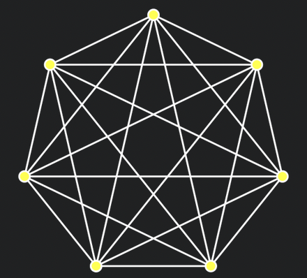

[[02 · Group Key Agreement with BeeKEM]]

See also:
[[Group Messaging for Secure Asynchronous Collaboration|Causal TreeKEM]]
[[Key Agreement for Decentralized Secure Group Messaging with Strong Security Guarantees]]

# Understanding Keyhive's BeeKEM Algorithm

Ink & Switch's *Keyhive* project, a capabilities-based system for [[Conflict-Free Replicated Data Types|CRDT]] authorisation and sync, is set to unlock a new world of privacy-preserving local-first apps. Performant CRDT implementations like Automerge, Yjs and Loro have been transformative in making it possible to build apps that don't inherently require a central server to ensure state consistency in multiplayer apps, but in practice we tend to still rely on central servers for sync (and this isn't likely to go away any time soon), with all the privacy implications that come with that. 

While it is possible to end-to-end encrypt CRDT operations, CRDT implementations are generally designed in such a way that single operations (often representing, for example, a single keystroke) are ideally batched together into compressed operation *runs*, to avoid needing to store an enormous amount of metadata per document. If we end-to-end encrypt each operation, we lose the benefit of those optimisations to the point that CRDTs are actually not a practical solution anymore.

Another related issue is that generally, multiplayer apps are generally collaborate for bigger groups, meaning that offering something comparable to Signal-style end-to-end encryption involves really thinking about all the tradeoffs for the various solutions to [[Secure group messaging]], including considering how those solutions gel with the inherent concurrency of CRDTs and local-first apps.

But more generally, end-to-end encryption only represents the *read* piece of the broader puzzle of distributed authorisation. Keyhive aims to solve for capabilities in general, making it possible to model typical access control roles like 'read', 'write' and 'admin' through a chain of cryptographic certifications. Since I've been working on local-first apps for a while, most recently with [Muni Town](https://muni.town/), and privacy is one of my biggest concerns, I'm naturally very excited about Keyhive. Muni Town is also set on building our core data engine on top of the affordances offered by Keyhive, so I need to try and wrap my head around it.

As it's a truism that cryptography can turn all sorts of problems into key management problems, I'm interested in the Key Encapsulation Mechanism the Keyhive team has designed, 'BeeKEM'. While they haven't published a paper as yet, there is a [Lab Notes article](https://www.inkandswitch.com/keyhive/notebook/02/), various bits of [documentation](https://github.com/inkandswitch/keyhive/blob/main/keyhive_core/src/cgka/README.md), and a Rust [implementation](https://github.com/inkandswitch/keyhive/tree/main/keyhive_core/src/cgka), and to try to learn-by-teaching, I'll be doing my best in this post to explain how it works.
## Secure messaging basics

Since Signal protocol (aka the Double Ratchet algorithm) set a new standard for end-to-end encrypted messaging, there has been a lot of academic focus on abstracting and formalising the key components and pushing them further. Signal protocol is fundamentally designed for two-party secure messaging (2SM), meaning that every message sent using the protocol is encrypted with a key that is shared only with the recipient, which (through very clever use of [[Diffie-Hellman key exchange]] and keyed hash functions) they both independently derived for that message. It's possible to use the Signal protocol for group messaging by applying the two-party protocol for every pair of group members. The catch is that you have to re-encrypt your messages for every group member, and everyone has to derive keys for everyone else, so in general for *n* group members there is *n^2* complexity, which gets infeasible fast.


> A *complete graph*, representing the number of pairwise protocol instantiations for a Signal group of 7 people. [Source](https://en.wikipedia.org/wiki/Complete_graph#/media/File:Complete_graph_K7.svg)

Academics and industry people have since dedicated a lot of attention to finding a solid way to achieve efficient *secure group messaging* (SGM). A key requirement for this was to make it possible for encrypted message *broadcast* - that is, for each group message we send, we can broadcast **one** encrypted message for the entire group to decrypt - without losing the key security properties of Signal protocol. Thus far the most widely adopted approach has been [[Sender Keys]], used by WhatsApp and Signal. Essentially every group member sends every other group member, via pairwise 2SM, a symmetric key that it will use to encrypt messages. To receive messages, users keep a list of these keys, one for each other member. These keys can then be 'ratcheted' with a keyed hash function to derive new keys for each message - once the old keys are deleted, this provides [[Forward secrecy]], meaning that old encrypted messages are protected from a later key compromise. This simple approach makes application-level stuff (sending messages) fairly efficient - it's just the group-level (key management) stuff, such as adding and removing members, which retains the performance limitations of pairwise groups.

## TreeKEM

Improving further on this, the [[Messaging Layer Security]] (MLS) standard has been published, representing a community convergence on a solid approach to secure group messaging. MLS significantly improves on the key management part through the **TreeKEM** (sub-)protocol. In TreeKEM, rather than having to negotiate one key for each sender, the group members coordinate to calculate a single key that is shared between everyone. Here's how it works:

When new members join a group, they are assigned a *position* among the leaves of what's called a left-balanced binary tree (LBBT). These look like this:


Once you know your position in the tree, you can work out who your *sibling* is - the node that shares a parent with you. Next we can imagine that every node may correspond to a public and private key pair. 

Something that was helpful for me in understanding this idea of the members being in a *tree* was to clarify that there isn't actually any single node that contains all of the data in this tree. We can know all the public keys for every node, but in general, you only know the secret keys for yourself and any nodes above you, up to the root. This is fine, because all we actually care about in the end is working out the secret key for the root. We do that through [[Diffie-Hellman key exchange|Diffie-Hellman (DH) key exchange]] between the sibling of the nodes we know secret keys for, starting with our own node.


> This stuff is also explained in Ink & Switch's [Lab Notes on BeeKEM](https://www.inkandswitch.com/keyhive/notebook/02/)

So if I've generated a key pair, and I know my sibling's public key, I can just use discrete logarithm magic to 'combine' them together and end up with the same secret that my sibling got from combining their secret with my public key. 


Once I have calculated the secret for the parent of me and my sibling, we can work out our parent's parent using the public key of our parent's sibling - on and on up to the root. 

> [!NOTE]
> On first look I had assumed the DH secret was the secret part of the key pair. Actually, the member performing an update will generate random new key pairs for the whole path (not including the root) and then encrypt them using the shared secret at each node.

Now we understand the basic structure, we can look at three main operations. The first is **updating the group secret**. Basically any group member can at any time 'blank' (delete) all the keys on its path up to the root and generate new ones as per above, and they just need to broadcast the new public keys at each of the nodes. 

The second is **removing a member**, which is essentially done by updating the group key and not telling the removed member the new public keys. We also reorganise the tree here so it's still a left-balanced binary tree.

Thirdly, any group member can **add a member**, by creating a new leaf in the LBBT and generating key pairs for the new path from the new member up to the root. It sends the new member an encrypted 'welcome message' including all the public keys in the tree and the full key pairs for the entire path. Once the new member is added, they should probably perform an update to rotate all their key material.

> [!QUESTION] How is the encrypted welcome message sent?
> The new member hasn't been added to the group yet, so the welcome message can't be sent using the group secret - it needs to be *out of band* of the group. This could be done in various ways - a Signal message, for instance - but in MLS it is achieved with Public Key Infrastructure that can deliver a fresh public key for any user to the adding member.

All together these are the three essential operations of TreeKEM.

### TreeKEM and Strong Consistency

CRDTs provide Strong Eventual Consistency, which is a kind of non-trivial eventual consistency. The original paper motivates this definition:

> Several \[Eventual Consistency] systems will execute an update immediately, only to discover later that it conflicts with another, and to roll back to resolve this conflict. This constitutes a waste of resources, and in general requires a consensus to ensure that all replicas arbitrate conflicts in the same way.
> [[Conflict-Free Replicated Data Types|Shapiro et al, 389]]

Ok, to be fair, that doesn't sound that trivial, but the point is that it's not the ideal approach. Strong Eventual Consistency means that we can actually apply updates in different orders and still arrive at the same state. In other words, we can model updates as a partial order, rather than a total order.

TreeKEM in general assumes a total order of state updates, which is less tolerant of network partitions. Every member is responsible for keeping their local copy of the tree up to date, and make updates (such as adding a member) directly to it, but if it turns out someone else added another member concurrently, the server could easily come back and say *Sorry, that position in the tree is taken! You need to roll back and try again.*

### Me getting distracted

Here's a quote from [[Key Agreement for Decentralized Secure Group Messaging with Strong Security Guarantees|Weidner et al.]]:

> MLS allows several PCS updates and group membership changes to be **proposed** concurrently, but they only take effect after being **committed**, and all users must process commits strictly in the same order. A proposal also blocks application messages until the next commit. In the case of a network partition \[...], it is not safe for one subset of users to perform a commit, because a different subset of users may perform a different commit, resulting in a group state inconsistency that cannot be resolved. As a result, MLS typically depends on a semi-trusted server to determine the sequence of commits. There is a technique for combining concurrent commits [ 8 , §5], but this approach does not apply to commits that add or remove group members, and it provides weak PCS guarantees for concurrent updates. (Section 3)

Wait, what are proposals and commits? **Commits** are what we've been talking about - operations on the group state. **Proposals** are essentially just a way, in MLS, of pre-checking with the server if a commit will be allowed: is it well-formed, does it conflict with any (server-set) policies, and possibly checking with other group members if they approve the change too. But hold on - did it say application messages get blocked? Multiple LLMs tried to mislead me on this so for clarity:

> Some operations (like creating application messages) are not allowed as long as pending proposals exist for the current epoch.
> [OpenMLS Book - Committing to pending proposals](https://book.openmls.tech/user_manual/commit_to_proposals.html)

What does it mean that if a subset of users performs a different commit, there will be a state inconsistency that cannot be resolved? 

Proposals and commits aren't, from what I can tell, part of BeeKEM, so just going to leave that question for another time.
## BeeKEM vs TreeKEM

> BeeKEM is our variant of the [TreeKEM] protocol (used in [MLS]) and inspired by [Matthew Weidner's Causal TreeKEM][Causal TreeKEM]. The distinctive feature of BeeKEM is that ==when merging concurrent updates, we keep all concurrent public keys at any node where there is a conflict (until they are overwritten by a future update along that path)==. The conflict keys are used to ensure that ==a passive adversary needs all of the historical secret keys at one of the leaves in order to read the latest root secret after a merge==.
> 
> Leaf nodes represent group members. Each member has a fixed identifier as well as a public key that is rotated over time. ==Each inner node stores one or more public keys== and an encrypted secret used for (deriving a shared key for) decrypting its parent.
> 
> ==During a key rotation, a leaf will update its public key and then encrypt its path to the root==. For each parent it attempts to encrypt, it will encounter one of a few cases:
* In the "normal" case, the child's sibling will have a single public key and a corresponding secret key. The child uses the public key of its sibling to derive a shared Diffie Hellman (DH) secret. It then uses this shared DH secret to encrypt the new parent secret.
* In case of a **blank or conflict sibling**, the encrypting child encrypts the secret for each of the nodes in its sibling's resolution (which is the set of the highest non-blank, non-conflict descendents of the sibling). This means a separate DH per node in that resolution. These encryptions of the secret are stored in a map at the parent.
> [`beekem.rs`](https://github.com/inkandswitch/keyhive/blob/fdf996c6aa07ffd2672ec2177ce4bd2b8416bdb3/keyhive_core/src/cgka/beekem.rs)

Let's have a look at the `beekem.rs` code:

The **root** is an `InnerNode`. 

Here's how to define a BeeKEM tree with **two leaves** using the provided code:

### Tree Structure (2 leaves):
```
     3 (root - InnerNode)
   /   \
 0      1 (leaves)
```

### Code to Create the Tree:
```rust
use crate::{
    crypto::share_key::ShareKey,
    principal::{
        document::id::DocumentId,
        individual::id::IndividualId,
    },
};

// 1. Initialize required IDs and keys
let doc_id = DocumentId::new(b"example_doc_id"); // Replace with actual doc ID
let member1_id = IndividualId::new(b"member1");   // Replace with actual ID
let member2_id = IndividualId::new(b"member2");   // Replace with actual ID

// Generate keys for members (in practice, use proper crypto)
let member1_pk = ShareKey::generate(&mut rand::thread_rng());
let member2_pk = ShareKey::generate(&mut rand::thread_rng());

// 2. Create the tree with first member
let mut tree = BeeKem::new(doc_id, member1_id, member1_pk)
    .expect("Failed to create tree");

// 3. Add second member
let member2_leaf_idx = tree.push_leaf(member2_id, NodeKey::ShareKey(member2_pk));

// Now the tree has:
// - Leaves at indices 0 (member1) and 1 (member2)
// - Root inner node at index 3
```

### Key Properties:
1. **Leaf Indices**:
   - `0`: First member (`member1_id`)
   - `1`: Second member (`member2_id`)

2. **Inner Nodes**:
   - `3`: Root node (only inner node in this tree)

3. **Tree Math**:
   ```rust
   assert_eq!(tree.tree_size, TreeSize::from_leaf_count(2));
   assert_eq!(treemath::root(tree.tree_size),	TreeNodeIndex::Inner(InnerNodeIndex::new(3)));
   ```

5. **Path Examples**:
   - Member 0's path to root: `[0 → 3]`
   - Member 1's path to root: `[1 → 3]`


Does BeeKEM tolerate network partitions as well as [[Key Agreement for Decentralized Secure Group Messaging with Strong Security Guarantees|DCGKA]]? If so is there a novel innovation here that makes O(log n) updates still possible?


> For CGKA, we have developed a concurrent variant of [TreeKEM](https://inria.hal.science/hal-02425247/file/treekem+\(1\).pdf) (which underlies [MLS](https://messaginglayersecurity.rocks/)). TreeKEM itself requires strict linearizability, and thus does not work in weaker consistency models. Several proposals have been made to add concurrency to TreeKEM, but they either increase communication cost exponentially, or depend on less common cryptographic primitives (such as commutative asymmetric keys). We have found a way to implement a causal variant of TreeKEM with widely-supported cryptography ([X25519](https://datatracker.ietf.org/doc/html/rfc8410) & [ChaCha](https://en.wikipedia.org/wiki/Salsa20#ChaCha_variant)). There should be no issues replacing X25519 and ChaCha as the state of the art evolves (e.g. [PQC](https://en.wikipedia.org/wiki/Post-quantum_cryptography)), with the only restriction being that the new algorithms must support asymmetric key exchange. We believe this flexibility to be a major future-looking advantage of our approach. Our capability system drives the CGKA: it determines who's ECDH keys have read (decryption) access and should be included in the CGKA —  something not possible with standard certificate capabilities alone.
> [Keyhive Repo - Design](https://github.com/inkandswitch/keyhive/tree/fdf996c6aa07ffd2672ec2177ce4bd2b8416bdb3/design)


Hey @alexg and @Brooke Zelenka, I've been trying to wrap my head around BeeKEM over the last few days and have something I'd love your help understanding: In `beekem.rs` where the comment says:

> During key rotation [...] In case of a **blank or conflict sibling**, the encrypting child encrypts the secret for each of the nodes in its sibling's resolution (which is the set of the highest non-blank, non-conflict descendents of the sibling). This means a separate DH per node in that resolution. These encryptions of the secret are stored in a map at the parent.

What do **blank** and **conflict** siblings respectively represent? I can vaguely guess at how, due to concurrent operations, a node might have none or multiple IDs/keys assigned to it, but it feels kind of tricky for me to grasp how exactly it happens. I'd also love to know if Keyhive retains the concept of proposals and commits from MLS - guessing not


# [BeeKEM](https://github.com/inkandswitch/keyhive/tree/main/keyhive_core/src/cgka)

## Definitions

_encrypter child_: the child node that last encrypted its parent.

_inner node_: a non-leaf node of the BeeKEM tree. It can either be blank (`None`) or contain one or more public keys. More than one public key indicates the merge of conflicting concurrent updates. Each public key on an inner node will be associated with a secret key which is separately encrypted for the encrypter child and all members of that encrypter child's sibling resolution.

_leaf node_: the leaf of the BeeKEM tree, which corresponds to a group member identifier and its latest public key/s. A leaf node can also be blank (`None`) if either (1) it is to the right of the last added member in the tree or (2) the member corresponding to that node was removed (in this case, the blank functions as an implicit tombstone).

_ownership of a tree_: you own a tree if you can use it to encrypt a new root secret. An owner will correspond to one of the members of the tree group (and hence one of its leaves).

_resolution_: either (1) the public key/s of a node or (2) if the node is blank or contains conflict keys, all of its highest non-blank, non-conflict descendants' public keys. The resolution is never taken at the root, so the worst case resolution is the n / 2 leaves of one of the root's child sub-trees if all of that sub-tree's inner nodes are blank or contain conflict keys.

## Invariants

- A group will always have at least one member. Hence, a tree will always have at least one non-blank leaf.
- In a subset of operations, concurrent adds and removes must be ordered last (because they blank inner nodes).

### Properties that must be ensured by Keyhive

- Causal ordering (and receipt) of CGKA operations.

### Public Key invariants

- After a node is updated and a new secret encrypted, it will have a single public key (corresponding to that new secret).
- A node encrypting its parent will always have a single public key. That's because
	- you can only encrypt starting from the leaf you own,
	- the leaf you own will always have a single public key in your copy since you will always have all causal predecessors and will have written the latest one, and
	- each parent you encrypt up your path will have a single public key after encryption.
- A node might have multiple conflicting public keys if concurrent updates from other members are merged into your tree. Each public key corresponds to a separate secret key.

## Notes

- A root secret will always correspond with a specific key rotation (update) at one of the leaves.
- After a merge of two concurrent operations, the tree will no longer have a root secret.

# GPT Take

BeeKEM is basically TreeKEM with a big “keep-all-the-concurrent-keys” twist. Here’s the nutshell:

- **Conflict handling**
    - **TreeKEM**: Whenever two people rotate keys at the same time, one update wins (or you have to roll one back). You don’t keep the “losing” public keys around.
    - **BeeKEM**: If two leaves update concurrently, any inner node that sees conflicting siblings will stash _all_ the new public keys there (in a `ConflictKeys`), rather than throwing any away.
- **Merge semantics**
    - **TreeKEM**: Not designed for true concurrent merges—you end up serialising updates or running an external merge protocol.
    - **BeeKEM**: Built for causal merging. The `apply_path` method will deterministically merge concurrent adds/removes by sorting new leaves and blanking old paths, and inner nodes merge their secret stores instead of clobbering them.
- **Security guarantees**
    - **TreeKEM**: Security reduces to the last writer wins; a passive eavesdropper needs only the latest secrets on one path.
    - **BeeKEM**: A passive adversary must compromise _every_ historical secret key on _some_ leaf in the merged history in order to derive the current root key—because you’ve kept every concurrent public key around until it’s explicitly overwritten.
- **Complexity trade-off**
    - **TreeKEM**: More lightweight—only one key per node, minimal state.
    - **BeeKEM**: Inner nodes can blow up in size if you get lots of concurrent updates, since each conflict resolution may add multiple DH‐encrypted secrets to the `SecretStore`.
- **Use cases**
    - **TreeKEM**: Best for mostly sequential groups (like typical MLS), where you can live with O(log n) updates and simple path encryption.
    - **BeeKEM**: Better when you expect high‐concurrency, offline edits, or want to merge membership ops without coordination.
		In short, BeeKEM = TreeKEM + causal merge + “keep every conflict key” → stronger merge guarantees at the cost of bigger nodes and more DH operations.

### In Code
Here are the hotspots where BeeKEM veers away from a vanilla TreeKEM implementation:

**Conflict‐tolerant inner nodes**
In `SecretStore`, inner nodes carry multiple encrypted secrets (one per conflicting public key) rather than a single key.

Look at `encrypt_new_secret_store_for_parent` (around the sibling‐resolution logic): it iterates over every node in the sibling’s resolution and sticks _all_ those DH encryptions into the `secret_map`.
```rust
if sibling_resolution.is_empty() { … } else {
  for idx in sibling_resolution {
	let encrypted_sk = encrypt_secret(…);
	secret_map.insert(idx, encrypted_sk);
  }
}
SecretStore::new(new_parent_pk, child_pk, secret_map)
```
That “multiple inserts” is pure BeeKEM.

**Keeping conflict keys around**
In `should_skip_for_resolution` (and its use in `append_resolution`) you’ll see how blank _or_ conflicted inner nodes get expanded into their children, rather than treated as “one key or nothing.”
```rust
fn should_skip_for_resolution(&self, idx: TreeNodeIndex) -> bool {
  match idx {
	TreeNodeIndex::Inner(i) => self.inner_node(i).as_ref().is_none_or(|n| n.has_conflict()),
	_ => …,
  }
}
```
**Merging concurrent updates**
`apply_path` is where BeeKEM actually _merges_ two paths. Instead of overwriting, it calls:
```rust
current_node.merge(node, &removed_keys_set);
```
That `merge` call (on both `LeafNode.pk` 
via `NodeKey::merge` and on `SecretStore::merge`) folds in _both_ sets of keys.

**Deterministic add/remove ordering**
In `sort_leaves_and_blank_paths_for_concurrent_membership_changes`, BeeKEM will blank out and then re‐push concurrently added leaves in sorted order. TreeKEM simply fails or serialises—you won’t find anything like this in the original spec.

**Root‐key ancestry tracking**
The field `current_secret_encrypter_leaf_idx` plus the LCA logic in `decrypt_tree_secret` lets BeeKEM handle decryption over a merged, branching history. TreeKEM just assumes a single writer path.

Every one of those pieces—multi‐encrypt in `encrypt_new_secret_store_for_parent`, conflict resolution in `should_skip_for_resolution`/`append_resolution`, merging in `apply_path`, and the leaf‐sorting logic—are where BeeKEM departs from the one‐writer, one‐path TreeKEM design.