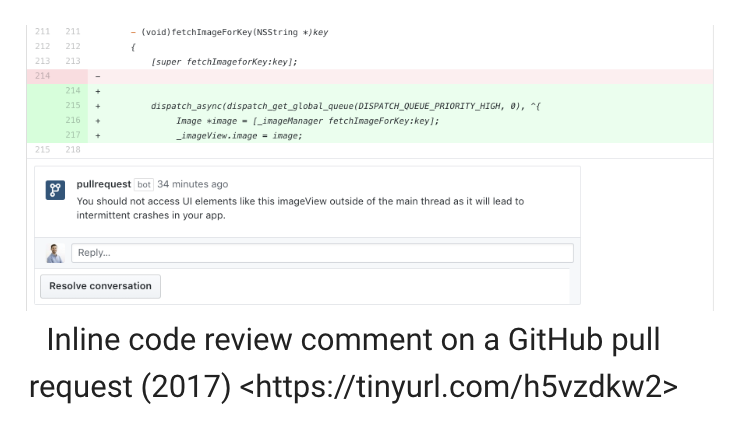

### 1. Collaborative code review

Collaborative code review is a process in software development where multiple developers examine, discuss, and provide feedback on code changes before those changes are merged into the main codebase. This practice is an essential part of the development workflow and is often facilitated by code review tools and platforms. In general, there are two most popular code review approaches.

#### Traditional Fagan inspection

A Fagan inspection, also known as a Fagan inspection meeting or Fagan review, is a software inspection method named after its creator, Michael E. Fagan. It is a formal process used for reviewing and improving the quality of software artifacts, such as source code, design documents, or test plans. The primary goal of Fagan inspections is to identify and correct defects early in the development process, before the software is implemented.

- Planning: Define the scope and objectives of the inspection, select the participants, and schedule the inspection meeting.
    
- Overview: The author provides an overview of the software artifact to be inspected, explaining its purpose, structure, and design.
    
- Preparation: Participants individually review the software artifact before the inspection meeting, identifying potential defects and areas of concern.
    
- Inspection: The inspection meeting takes place, during which participants discuss their findings, ask questions, and work together to identify and document defects. The focus is on improving the quality of the software artifact.
    
- Rework: The author incorporates the identified changes and corrections into the software artifact. If necessary, additional inspection meetings may be held to verify that the corrections have been made.

Fagan inspections are known for their systematic and structured approach, helping to uncover defects early in the development process when they are less expensive to fix. This method has been widely used in software engineering to improve the overall quality of software products. However, the specific details and variations of the process may vary depending on the organization and the type of software being developed.

#### Modern code review

Modern code review is a software development practice that involves systematically examining and evaluating source code changes made by other developers before those changes are integrated into the main codebase. This process aims to catch bugs, improve code quality, and ensure that the changes align with the project's standards and goals. Several platforms and tools support modern code review, with four prominent examples being GitHub, GitLab, BitBucket, and Gerrit.