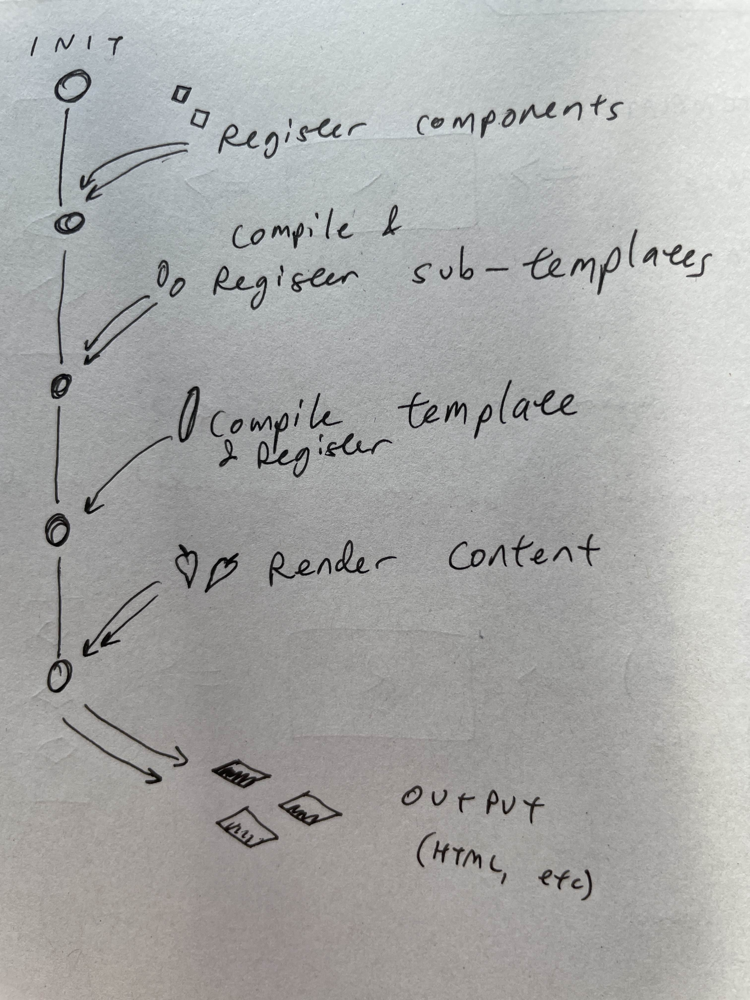

I've created a simple render module which I'm calling `leaf-render`. It applies the Minijinja templating engine (a slightly constrained Rust implementation of Jinja2) to Leaf entities. 

[[Leaf]] is a local-first data engine that represents all data as 'entities' in an *entity-component-system* (ECS) architecture. An entity is always defined as a composition of components, where a component is a kind of generic description of a property of data. A blog post might have Title, Date, Author and Content components. If all data is a composition of generic semantic properties, we can interact with the same data in various interfaces, giving us interoperability and improving user autonomy. It also gives us high level a way of evolving schemas and adding features without breaking things. 

The latest Muni Town app, Roomy, aims to take advantage of this flexibility by building a community-oriented group chat where channels, threads, posts and articles can all blend and fluidly evolve. So it makes sense to try to design a render module in a way that is broadly applicable to a lot of different contexts, whether we are outputting HTML, Markdown, CSV or something else. The starting place for that is a templating engine.

Here's the high level API design I landed on for the render module:

The separation of templates from sub-templates above reflects my intention to check all sub-template dependencies are satisfied before registering a template. When it came to implementing this design, I found that it was not quite as straightforward to extract the template dependencies from the parsed template, so I skipped implementing this checking logic for now, meaning those two stages in the flow are actually identical. 

Generating HTML for a personal website of course is quite low stakes and the failure mode here (spitting out the syntax as plain text) is fairly harmless, but it improves the dev experience to have errors like this be clearly announced and it makes the system more robust for larger scale projects. My priority, in [[Organ]] as well as here, was to find a way to map templates to data schemas not just to prevent errors but also to enable discovery on a potential future template marketplace that is appropriately scoped to the data you need to render.

A few things worth noting:
- Static analysis, dependency checking, component schemas
- Manual memory management

Questions about component schema definition languages

- JSON Schema
- ATProto Lexicons
- IPLD Schema

[[Technical comparison of schema definition languages]]

> Approach to rendering Leaf

meri — 12/5/2025, 5:23 pm
Maybe an interesting example. I was doing some data analysis work for a barrister that involved parsing a lot of rich text case judgements and turning it into structured data, and something I was imagining doing with Organ was being able to create a way to render that structured data (with a lot of custom fields) into a really intuitive UI for exploring the legal data, including generating tables, search, and pages for each case
so as well as the HTML etc, being able to output a JSON index of the input data might be an application
for search applications
right now i'm imagining at least two broad classes of plugins: transformations (including parsing) and render systems
so i think a transformation would take n inputs and produce 1 output, and a render system is 1 to 1

meri — 12/5/2025, 5:31 pm
I think a transformation applied to a dependency graph of template files parsed to ASTs can be equivalent to pretty much any templating system, it just inlines the dependencies. Still thinking it through tho

erlend — 12/5/2025, 5:51 pm
Cool. My main concern is that we don’t end up with the same problem as Notion, namely this very separate process to handle ‘Website-as-a-service’. It should all just be integrated, like with WordPress.
More assorted thoughts on progressive enhancement here: https://github.com/muni-town/weird/issues/8

erlend — 12/5/2025, 5:59 pm
As I understand it, the plug-in system facilitates a good setup for this. It also enables a bunch of other stuff though, like the JSON index example above.

meri — 12/5/2025, 6:01 pm
Yeah, for sure. Making sure it all can happen efficiently on the client is a good challenge

meri — 12/5/2025, 6:11 pm
So I imagine progressive enhancement here just means basically dynamic import and caching of wasm modules for whatever render pipeline the user wants

...

Zicklag — 13/5/2025, 2:56 am
Templates get a little more "n to 1" when you think about lists of blog posts, where you've got the title and excerpt for each blog posts.
So I think that maybe they are actually very similar and almost identical use-cases under-the-hood, it just depends more on where you wan to send it after generating.
That also brings up a though because it tends to come up "what if you want to publish your Leaf data to ATProto for public broadcast use-cases", and in that case, "how are you going to conver it to Lexicons"?
I think the answer might very well be essentially the same system we use to convert to HTML websites.
For your legal system use-case, too, that can just be an HTML website with embedded JSON data and JS for querying / interacting with it. Or even something crazy like this: https://phiresky.github.io/blog/2021/hosting-sqlite-databases-on-github-pages/
Hosting SQLite databases on Github Pages - (or IPFS or any static f...
I was writing a tiny website to display statistics of how much sponsored content a Youtube creator has over time when I noticed that I often write a small tool as a website that queries some data from a database and then displays it in a graph, a table, or similar. But if you want to use a
^ ( the sqlite on GitHub pages thing is mostly tangential, so don't get too distracted by it, but I was just thinking if you wanted to grab a bunch of data from Leaf for aggregation / analysis in a web page, that might be an interesting solution, to convert it to a SQLite database and then use that guy's hack to load it in the webpage )

meri — 13/5/2025, 7:46 am
Yeah very cool. Before I was using Loro for organ I was storing everything using SQL.js which runs wasm SQLite in the  browser, which was actually pretty decent

meri — 13/5/2025, 7:49 am
So I didn’t fully explain this but with my proposed ‘transformations’ and ‘render systems’ approach, a transformation can resolve all the dependencies of a template including content like pages, and then inline that content into the template. Or alternatively given a list of dependencies a transformation could generate a view over the list and pass that in to the render system for the list
I’m really interested in ATProto record output too
I guess also a render system is just a special case of a transformation. I’m not sure what the most useful boundary of modularity is where you could say ‘that’s a plugin!’ but i think it makes some sense to break it all down into these functions that can have different kinds of signatures and to view the entire output process as a composition of those functions

meri — 13/5/2025, 7:56 am
It just depends what we want the inputs (e.g. template files?) and outputs (e.g. ATProto records?) to be
I think the main benefit of having templating languages is that it doesn’t need to be compiled to wasm to be executed safely
therefore developer-users can customise render output in browser
If we break rendering down into a composition of these more granular functions then we can support render outputs from multiple different templating languages and also render outputs that don’t require templating, like if someone just wants to export their data as markdown with yaml frontmatter, or as CSV