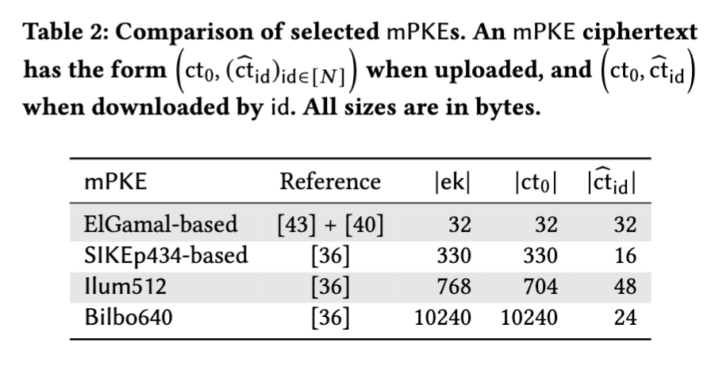

---
aliases:
  - mPKE
---
[[How to Hide MetaData in MLS-Like Secure Group Messaging - Simple, Modular, and Post-Quantum]]:

A.2 Decomposable Multi-Recipient Public Key Encryption A multi-recipient PKE (mPKE) [ 13 , 43 , 56 ] is a type of PKE that allows a party to send the same message to a set of recipients of size 𝑁 , more efficiently than executing 𝑁 parallel runs of a standard PKE. In this work, we use a decomposable m PKE introduced in [ 40] that mandates a m PKE ciphertext to be decomposable into a recipient-dependent and independent part. [40] showed that many assumptions known to imply PKE (e.g., DDH, LWE, SIDH) can naturally be used to construct an IND-CCA decomposable mPKE in the random oracle model

Multi-recipient PKE. For pre-quantum security, one may combine Kurosawa’s multi-recipient variant [ 43 ] of ElGamal with the transform of [40], whose decomposability property makes it amenable to the selective downloading performed by Chained CmPKEctxt.

13. Manuel Barbosa and Pooya Farshim. 2007. Randomness reuse: Extensions and improvements. In IMA International Conference on Cryptography and Coding. Springer, 257–276. 
43. Kaoru Kurosawa. 2002. Multi-recipient Public-Key Encryption with Shortened Ciphertext. In PKC 2002 (LNCS, Vol. 2274), David Naccache and Pascal Paillier (Eds.). Springer, Heidelberg, 48–63. https://doi.org/10.1007/3-540-45664-3_4 
56. Nigel P. Smart. 2005. Efficient Key Encapsulation to Multiple Parties. In SCN 04 (LNCS, Vol. 3352), Carlo Blundo and Stelvio Cimato (Eds.). Springer, Heidelberg, 208–219. https://doi.org/10.1007/978-3-540-30598-9_15 