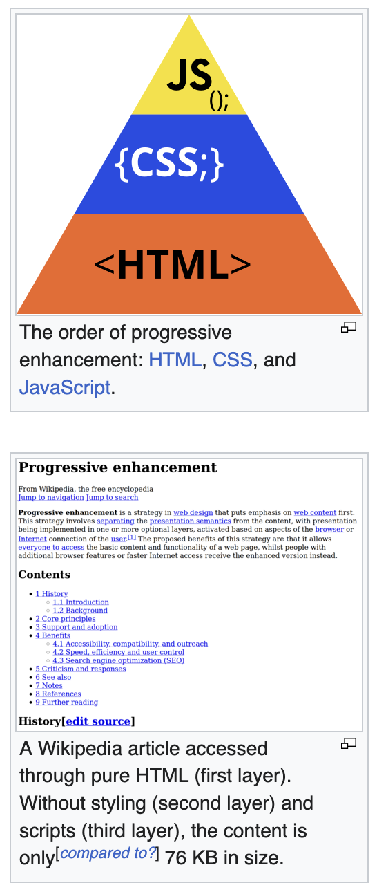

> [!NOTE] Wikipedia
> **Progressive enhancement** is a strategy in [web design](https://en.wikipedia.org/wiki/Web_design "Web design") that puts emphasis on [web content](https://en.wikipedia.org/wiki/Web_content "Web content") first, allowing [everyone to access](https://en.wikipedia.org/wiki/Universal_design "Universal design") the basic content and functionality of a web page, while [users](https://en.wikipedia.org/wiki/User_\(computing\) "User (computing)") with additional browser features or faster Internet access receive the enhanced version instead. This strategy speeds up loading and facilitates crawling by [web search engines](https://en.wikipedia.org/wiki/Web_search_engine "Web search engine"), as text on a page is loaded immediately through the [HTML](https://en.wikipedia.org/wiki/HTML "HTML") source code rather than having to wait for JavaScript to initiate and load the content subsequently, meaning content ready for consumption "out of the box" is served immediately, and not behind additional layers.[[1]] 
> This strategy involves [separating](https://en.wikipedia.org/wiki/Separation_of_concerns "Separation of concerns") the [presentation semantics](https://en.wikipedia.org/wiki/Presentation_semantics "Presentation semantics") from the content, with presentation being implemented in one or more optional layers, activated based on aspects of the [browser](https://en.wikipedia.org/wiki/Web_browser "Web browser") or [Internet](https://en.wikipedia.org/wiki/Internet "Internet") connection of the [client](https://en.wikipedia.org/wiki/Client_\(computing\) "Client (computing)"). In practice, this means serving content through [HTML](https://en.wikipedia.org/wiki/HTML "HTML"), the "lowest common denominator" of web standards, and applying styling and animation through [CSS](https://en.wikipedia.org/wiki/CSS "CSS") to the technically possible extent, then applying further enhancements through [JavaScript](https://en.wikipedia.org/wiki/JavaScript "JavaScript").[[4]] Deprecated [Adobe Flash](https://en.wikipedia.org/wiki/Adobe_Flash "Adobe Flash") could be thought of as having shared the final spot with JavaScript while it was widely in use.[[5]][[6]] Since web browsers can load site features to the extent supported rather than failing to load the entire site due to one error or missing feature in JavaScript, a progressively enhancing site is more stable and [backwards compatible](https://en.wikipedia.org/wiki/Backwards_compatible "Backwards compatible").[[4]]

