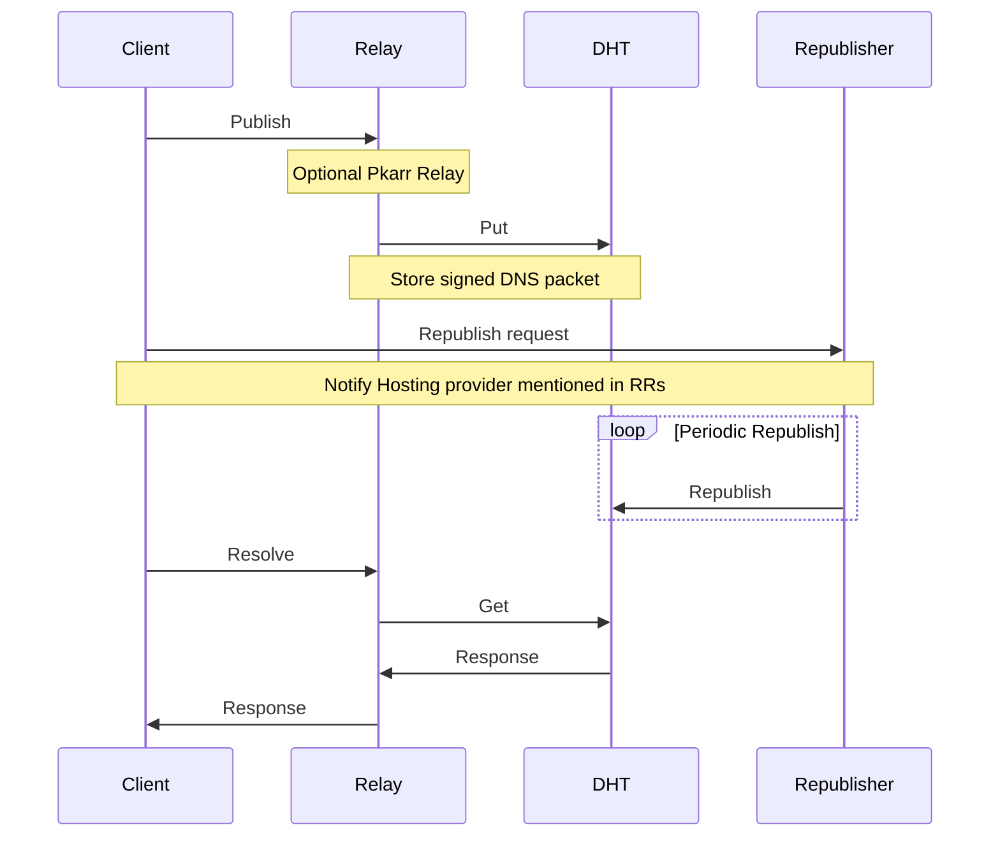

**[pkarr](https://github.com/pubky/pkarr)** Public

Public Key Addressable Resource Records (sovereign TLDs)

[app.pkarr.org](https://app.pkarr.org/ "https://app.pkarr.org")

[MIT license](https://github.com/pubky/pkarr/blob/main/LICENSE)

[Open in github.dev](https://github.dev/) [Open in a new github.dev tab](https://github.dev/) [Open in codespace](https://github.com/codespaces/new/pubky/pkarr?resume=1)

<table><thead><tr><th colspan="2"><span>Name</span></th><th colspan="1"><span>Name</span></th><th><p><span>Last commit message</span></p></th><th colspan="1"><p><span>Last commit date</span></p></th></tr></thead><tbody><tr><td colspan="3"></td></tr><tr><td colspan="2"><p><a href="https://github.com/pubky/pkarr/tree/main/.github/workflows"><span>.github/</span> <span>workflows</span></a></p></td><td colspan="1"><p><a href="https://github.com/pubky/pkarr/tree/main/.github/workflows"><span>.github/</span> <span>workflows</span></a></p></td><td><p><a href="https://github.com/pubky/pkarr/commit/151f5e75f0479ba6861e4127f65895473a349526">chore: update github workflow</a></p></td><td></td></tr><tr><td colspan="2"><p><a href="https://github.com/pubky/pkarr/tree/main/design">design</a></p></td><td colspan="1"><p><a href="https://github.com/pubky/pkarr/tree/main/design">design</a></p></td><td><p><a href="https://github.com/pubky/pkarr/commit/6c789e2c671a5e9d16a3167112d1fa738f67f710">fix(relay): replace If-Unmodified-Since with If-Match (</a><a href="https://github.com/pubky/pkarr/pull/137">#137</a><a href="https://github.com/pubky/pkarr/commit/6c789e2c671a5e9d16a3167112d1fa738f67f710">)</a></p></td><td></td></tr><tr><td colspan="2"><p><a href="https://github.com/pubky/pkarr/tree/main/pkarr">pkarr</a></p></td><td colspan="1"><p><a href="https://github.com/pubky/pkarr/tree/main/pkarr">pkarr</a></p></td><td><p><a href="https://github.com/pubky/pkarr/commit/d1e74d3291efe34b90b7a0b1ed78fe8bbabfc704">fix(pkarr): merge dht relay streams (</a><a href="https://github.com/pubky/pkarr/pull/142">#142</a><a href="https://github.com/pubky/pkarr/commit/d1e74d3291efe34b90b7a0b1ed78fe8bbabfc704">)</a></p></td><td></td></tr><tr><td colspan="2"><p><a href="https://github.com/pubky/pkarr/tree/main/relay">relay</a></p></td><td colspan="1"><p><a href="https://github.com/pubky/pkarr/tree/main/relay">relay</a></p></td><td><p><a href="https://github.com/pubky/pkarr/commit/285662ef315861ed397101289904a71d9de34210">chore: Release</a></p></td><td></td></tr><tr><td colspan="2"><p><a href="https://github.com/pubky/pkarr/blob/main/.dockerignore">.dockerignore</a></p></td><td colspan="1"><p><a href="https://github.com/pubky/pkarr/blob/main/.dockerignore">.dockerignore</a></p></td><td><p><a href="https://github.com/pubky/pkarr/commit/9c9dadba95820c0354f74d437fc60e1642cf104f">feat(server): add dockerfile</a></p></td><td></td></tr><tr><td colspan="2"><p><a href="https://github.com/pubky/pkarr/blob/main/.envrc">.envrc</a></p></td><td colspan="1"><p><a href="https://github.com/pubky/pkarr/blob/main/.envrc">.envrc</a></p></td><td><p><a href="https://github.com/pubky/pkarr/commit/a2666b25094ef1d45628f0d8817b6061a7fcfb90">chore: add Nix flake and Nix dev shell using flakebox</a></p></td><td></td></tr><tr><td colspan="2"><p><a href="https://github.com/pubky/pkarr/blob/main/.gitignore">.gitignore</a></p></td><td colspan="1"><p><a href="https://github.com/pubky/pkarr/blob/main/.gitignore">.gitignore</a></p></td><td><p><a href="https://github.com/pubky/pkarr/commit/14852935f1bcbf94091ec3f3e86ab467851a40af">fix: pkarr timestamp export and add.cargo/config.toml</a></p></td><td></td></tr><tr><td colspan="2"><p><a href="https://github.com/pubky/pkarr/blob/main/Cargo.lock">Cargo.lock</a></p></td><td colspan="1"><p><a href="https://github.com/pubky/pkarr/blob/main/Cargo.lock">Cargo.lock</a></p></td><td><p><a href="https://github.com/pubky/pkarr/commit/285662ef315861ed397101289904a71d9de34210">chore: Release</a></p></td><td></td></tr><tr><td colspan="2"><p><a href="https://github.com/pubky/pkarr/blob/main/Cargo.toml">Cargo.toml</a></p></td><td colspan="1"><p><a href="https://github.com/pubky/pkarr/blob/main/Cargo.toml">Cargo.toml</a></p></td><td><p><a href="https://github.com/pubky/pkarr/commit/08fd8b8ccdac6d9c6a90acd6f900ca1cd8c3a4b7">fix(pkarr): update simple-dns fixing segfaults while parsing</a></p></td><td></td></tr><tr><td colspan="2"><p><a href="https://github.com/pubky/pkarr/blob/main/Dockerfile">Dockerfile</a></p></td><td colspan="1"><p><a href="https://github.com/pubky/pkarr/blob/main/Dockerfile">Dockerfile</a></p></td><td><p><a href="https://github.com/pubky/pkarr/commit/5f58f13f891807a0e2994939f10452a138af43ac">feat(relay): rename server to relay everywhere that is relevant</a></p></td><td></td></tr><tr><td colspan="3"></td></tr></tbody></table>

## ==Pkarr==

> Public-Key Addressable Resource Records

[TLDR](https://github.com/Pubky/#tldr) • [Demo](https://github.com/Pubky/#demo) • [Architecture](https://github.com/Pubky/#architecture) • [Specifications](https://github.com/pubky/pkarr/blob/main/design/README.md) • [FAQ](https://github.com/Pubky/#faq)

---

The simplest possible streamlined integration between the Domain Name System and peer-to-peer overlay networks, enabling self-issued public keys to function as sovereign, publicly addressable, censorship-resistant top-level domains. This system is accessible to anyone capable of maintaining a private key.

Where we are going, this [https://o4dksfbqk85ogzdb5osziw6befigbuxmuxkuxq8434q89uj56uyy](https://app.pkarr.org/?pk=o4dksfbqk85ogzdb5osziw6befigbuxmuxkuxq8434q89uj56uyy) resolves everywhere!

## TLDR

- To publish resource records for your key, sign a small encoded DNS packet (<= 1000 bytes) and publish it on the DHT (through a relay if necessary).
- To resolve some key's resources, applications query the DHT directly, or through a [relay](https://github.com/pubky/pkarr/blob/main/design/relays.md), and verify the signature themselves.
- Clients and Relays cache records extensively and minimize DHT traffic as much as possible for improved scalability.
- The DHT drops records after a few hours, so users, their friends, or service providers should periodically republish their records to the DHT. Also Pkarr relays could republish records recently requested, to keep popular records alive too.
- Optional: Existing applications unaware of Pkarr can still function if the user added a Pkarr-aware DNS servers to their operating system DNS servers.

## Demo

Try the [web app demo](https://app.pkarr.org/) Or if you prefer Rust, check out our [Examples](https://github.com/pubky/pkarr/blob/main/pkarr/examples/README.md)

## Architecture




### Clients

#### Pkarr-enabled Applications

Native applications can directly query and verify signed records from the DHT if they are not behind NAT. Otherwise, they will need to use a Pkarr Relay.

Browser web apps should try calling the local Pkarr relay at the default port 6881. If not accessible, they must query a remote relay as a fallback. In either case, these apps should allow users to configure relays of their choice.

Clients with private keys can also submit signed records either directly to the DHT or through a Pkarr relay to update their records when needed.

#### Existing Applications

To support existing applications that are unaware of Pkarr, users will need to (manually or programmatically) edit their OS DNS servers to add one or more DNS servers that recognize Pkarr and query the DHT. However, the ideal outcome would be adoption by existing widely used resolvers like `1.1.1.1` (Cloudflare) and `8.8.8.8` (Google).

### Relays

Pkarr relays are optional but they:

1. Enable web applications to query the DHT through [relays](https://pkarr.org/relays)
2. Act as a large caching layer for many users to provide lower latency, better reliability, and improved scalability

Relays are very light and cheap to operate, making them easy to run altruistically. Private and paid relays are also possible.

### Republishers

Services and hosting providers mentioned in a user's Resource Records are incentivized to republish these records and keep them alive on the DHT, for the same reasons they are incentivized to gain that user in the first place.

### DHT

Pkarr uses [Mainline DHT](https://en.wikipedia.org/wiki/Mainline_DHT) as the overlay network, specifically [BEP44](https://www.bittorrent.org/beps/bep_0044.html) for storing ephemeral arbitrary data.

Reasons for choosing Mainline include:

1. 15 years of proven track record facilitating trackerless torrents worldwide
2. Largest DHT in existence with an estimated 10 million nodes
3. Generous retention of mutable data, reducing the need for frequent record refreshes
4. Implementations available in most languages, well understood by many experts, and stable enough for minimal custom implementation if needed

## Expectations

To ensure good scalability and resilience, a few expectations need to be set:

1. This is **not a storage platform**
	- Records are ephemeral and will be dropped by the DHT without regular refreshing
	- Popular records may be refreshed by DNS servers as they receive queries
2. This is **not a realtime communication** medium
	- Records are heavily cached like in any DNS system
	- Record updates should be infrequent, and relays enforce strict rate-limiting
	- Record updates may take time to propagate due to extensive caching, even with a 1-second TTL
	- In case of a cache miss, traversing the DHT might take few seconds.

## Why?

> Why would you need resource records for keys?

In pursuit of a sovereign, distributed, and open web, we identify three challenges:

1. **Distributed Semantics**: `Everything expressed as keys and metadata` Developing interoperable semantics for verifiable metadata about a set of public keys that form a digital identity, complete with reputation, social graph, credentials, and more.
2. **Distributed Database(s)**: `Anyone can host the data` Verifiable data alone is insufficient; a host-agnostic database is essential for an open web, as opposed to walled gardens.
3. **Distributed Discovery**: `Where is the data?`Before anything else, you need to efficiently and consistently discover the multiple hosts for a given dataset.

Addressing Distributed Discovery first makes the most sense for several reasons:

- The difficulty of these three challenges inversely correlates with their order.
- The marginal utility of solving these challenges positively correlates with their order.
	In existing and emerging open social network protocols, users do tolerate limited interoperability between clients, second-class identifiers controlled by hosting or domain servers, inefficient or non-existent conflict-free replication between data stores, and the absence of local-first or offline support. However, their most common complaints involve unavailability, censorship, deplatforming, and difficulty in securely managing keys.
- Distributed Discovery offers the greatest assured leverage by abstracting over current and emerging solutions for (1) and (2) as they compete, complement, and develop independently, all while maintaining the same long lasting identifier, so you don't have to start from scratch or be locked in.

### Leverage

**Solve the most issues**

Pkarr solves **unavailability** by turning public keys into resolvable URLs: resource **locator**. Pkarr solves **censorship and deplatforming** by allowing users to conveniently change DNS records to point to other providers or platforms. While there are other ways to do this, it is never as reliable and authoritative as DNS. Pkarr helps with **key management** by enabling users to maintain a long-lasting identity tied to one key, rarely used, and hopefully kept offline at all times.

Finally, by solving censorship and deplatforming in a sovereign way, the need for signed data becomes less urgent, and we buy more time to figure out the UX of signing everything everywhere all the time.

**with least work possible**

Pkarr doesn't need to bootstrap anything or invent anything, instead using 15 years old battle tested Distributed Hash Table (Mainline DHT) with millions of nodes, and good old web servers.

## FAQ

**Why not human readable domains on a blockchain?**

Introducing scarcity to names, arguably the most subjective and personal thing in our lives, serves noone except rent seekers. We already know how to use phonebooks, we just need to upgrade small numbers, to bigger sovereign keys.

**Why not GNU Name System?**

The GNU net is exciting and impressive, but I didn't have enough time to test it or understand how hard it would be to build a PoC on top of it.

GNU name system seems to support [Petname system](http://www.skyhunter.com/marcs/petnames/IntroPetNames.html) natively, which means it does require more storage and bandwidth from the DHT than a 1000 bytes max size enforced by Mainline DHT. I believe that petnameing should be left to application layer.

Luckily GNU net uses ed25519 key as well, so there is always a path for migration if we are careful.

**Why not \[insert ad hoc solution\] instead?**

Open social networks often attempt to solve discovery natively within their network of participants. However, this approach has several issues:

- It may conflict with participants' (usually service providers) self-interest in keeping users locked in.
- Their infrastructure would need to become a gossip overlay network, which may not be desirable.
- Achieving consistency and load balancing would require further optimization, effectively reinventing a DHT.
- If an overlay network is developed that surpasses the performance of a 10-million-node DHT with a 15-year track record, Pkarr should still be capable of utilizing your network as a backend, either as an alternative or alongside existing solutions.
**How can I run the Pkarr relay?**

To build and run the Pkarr relay using Docker, you could use a small `docker-compose.yml` such as:

```
services:
  pkarr:
    container_name: pkarr
    build: .
    volumes: 
      - ./config.toml:/config.toml
      - .pkarr_cache:/cache
    command: pkarr-relay --config=/config.toml
```

Alternatively, lunch docker correctly attaching the `config.toml` as a volume in the right location. In the example above `.pkarr_cache` relative directory is used to permanently store pkarr cached keys.

An example `./config.toml` can be copied from `./src/config.example.toml` and customized as needed.

This will make the Pkarr relay accessible at [http://localhost:6881](http://localhost:6881/).

## Releases 4

[\+ 3 releases](https://github.com/pubky/pkarr/releases)

## Packages

No packages published  

## Languages

- [Rust 98.5%](https://github.com/pubky/pkarr/search?l=rust)
- Other 1.5%