Cf [[LSM tree]]

# Sedimentree Sync

A method for storing and synchronising Automerge documents (or any causal commit DAG based data structure).

## Context and Motivation

### Commit graphs and metadata compression

Automerge documents retain their entire editing history in a hash linked commit graph,  much like Git. We'll be seeing a lot of commit graphs, I'll draw them like this:

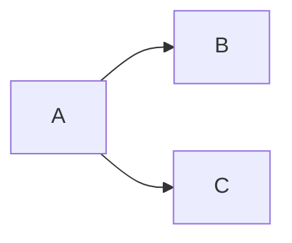

The letters represent commit hashes and the arrows point from parents to children.

In Git, commits are a snapshot of the filesystem and are made relatively infrequently. In Automerge, commits are sets of operations which should be applied to the document and are much more granular. We create an operation for every keystroke when editing text and we frequently create a commit for each operation. 

An Automerge document containing the string "hello" might well end up with a commit graph like this:

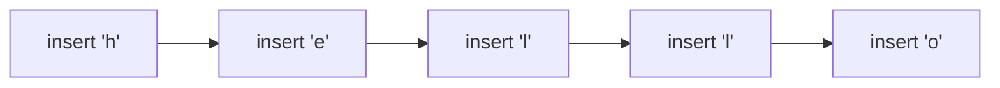

The operations themselves are not as simple as this graph suggests. Instead of 'insert {x}' the operation is more like 'insert {x} following operation {y}', where `y` is the ID of a previous insert operation. For this to work every operation has to have an ID associated with it.

A straightforward encoding of this structure adds a lot of metadata overhead to the underlying data. Fortunately we are able to compress most of this away. The details are quite fiddly but the important point is that we take advantage of the structure of chains of commits which are created one after another. 

The need to compress metadata has led to two different transport formats for Automerge documents. We either send individual commits (referred to in the Automerge API as "changes") or we encode the entire document. Which format we use depends on how we are synchronising and storing changes.

### The Current Sync Protocol

The current sync protocol is a two-party protocol which uses the commit graph of the document on each peer to determine what each end is missing. Roughly speaking each peer sends the heads of it's commit graph and then the other end responds with any known descendants. Bloom filters are used to summarise the current state of each peer and so the protocol may require multiple iterations due to bloom filter false positives.

Generally speaking the sync protocol operates in terms of commits, each end sends commits the other end may be missing. There is one important optimisation, when a peer determines that the remote end has no data at all (i.e. during initial synchronisation) then the peer sends the entire document as a single compressed chunk.

There are lots of details to this protocol, but the important points are:

* Running the protocol requires having the entire commit graph in memory - in order to perform ancestry calculations on it
* The protocol is iterated, so it is impossible to know up front how much work there is to do before you are synchronised
* Except in initial synchronisation we incur the metadata overhead of the commit graph because we are sending individual commit

### The problem

The largest problem we currently have with the sync protocol is the memory intensive nature of running a sync server. The ongoing work on runtime memory compression will ameliorate this issue, but another related problem looms. The Beehive project is working on implementing end to end encryption (bee-to-bee encryption) for Automerge which will require that sync servers do not have access to the plaintext of the commits in the commit graph - but this seems like it will make metadata compression much more complicated.

Recall that in the current sync protocol if a peer is performing initial synchronisation then we send them the entire compressed document in one go. This is crucial to avoid the bandwidth costs of the metadata overhead. Currently the sync server is able to produce this compressed document on the fly because it has the plaintext of the document available. In an end to end encrypted world all the sync server has is the commit graph, the actual contents of the commits are encrypted:

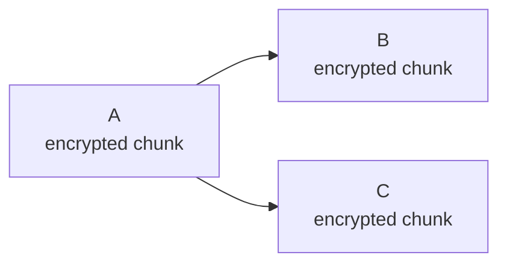

There is now no way for the sync server to produce a compressed document for initial sync. One way around this is to have plaintext nodes upload compressed documents to the sync server every so often. This raises questions: when should a plaintext node perform compression and how should sync servers decide which compressed chunk to send?

There is another problem with the commit-graph-plus-compressed-upload approach - it doesn't solve the metadata overhead problem for federated sync servers. Federating sync servers which both operate over ciphertext will be forced to download all of the commit DAG because otherwise they have no way of knowing whether they have all the content. Granted, sync servers are likely to have fast connections and capacious storage but I still think it's extremely undesirable to have sync servers have such unpredictable performance characteristics.

## Design Goals

* Predictable performance on both plaintext and ciphertext nodes
* Low metadata overhead for initial sync
* Low latency for staying-in-sync (real-time collaboration)
* Support for progress bars and pause/resume of large synchronisation tasks
* Stateless RPC style API (to facilitate horizontal scaling)
* Minimally expressive storage requirements (i.e. don't require transactions from the storage layer)

## Sedimentrees

### Overview

A sedimentree is a data structure which recursively compresses ranges of a commit graph in such a way that older commits (those close to the root of the graph) are compressed in larger chunks than newer commits. We can imagine the older chunks as being "underneath" newer chunks, like the strata of a sedimentary rock.

This:

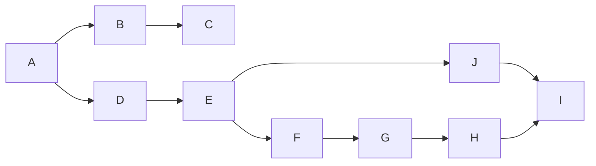

Becomes
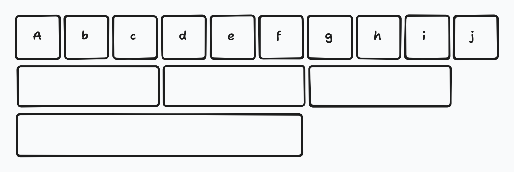
Where each rectangle is a chunk which contains all the chunks directly above it. Importantly only the lowermost stratum is needed, so this diagram can be simplified to:
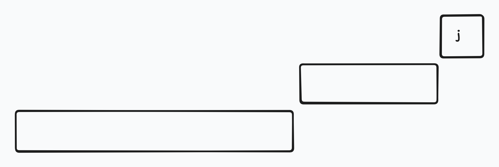
As implied by these diagrams, the sedimentree data structure first organises commits into a linear order and then compacts those ranges. We are able to do this in such a way that peers with overlapping but different commit graphs will agree on the boundaries and contents of each stratum and the contents of each stratum will contain commits ordered such that their metadata compresses well.

## Terminology

A "commit" refers to the abstract idea of a node in the DAG which has a payload, a hash, and a set of parents identified by hash.  A range of commits which has been compressed is referred to as a "stratum". A stratum has a start and end hash and zero or more interior "checkpoint" hashes - on which more later. If a commit is stored outside of a stratum it is a "loose commit". The payloads of both strata and loose commits are stored separately from the metadata about those objects as a "blob" - which is a content addressed binary array.
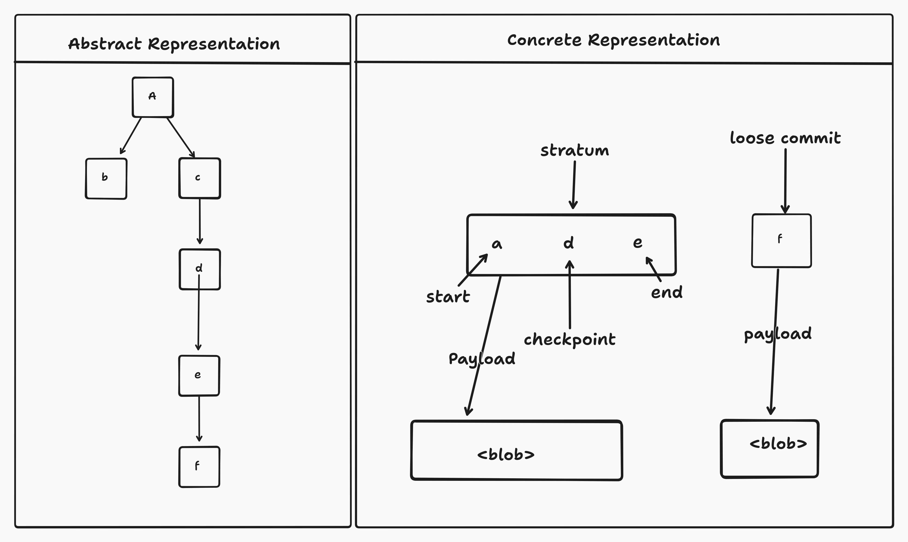
Each straum has a "level". Stratum with higher levels are further down in the sedimentree - composed of larger ranges of the commit graph. The first level stratum is level 1.

A stratum which contains the data from some strata or loose commits above it is said to "support" the smaller strata. A sedimentree can be simplified by removing all the strata or loose commits which are supported by strata below them recursively, such a simplified sedimentree is called "minimal".

## Constructing a Sedimentree

To construct a sedimentree we need these things

* A way to organise the commit DAG into a linear order
* A way to choose the stratum boundaries
* A way to recognise whenever one stratum supports another

All of these mechanisms need to produce the same results for the shared components of the history for peers with divergent commit graphs. Furthermore, we would like for chains of commits to be more likely to end up in the same stratum as this allows us to achieve better compression.

Here are the ingredients we are going to use:

* Order the graph via a reverse depth first traversal of the reversed change graph. I.e. start from the heads of the graph and traverse from commit to the parents of the commit
* Choose stratum boundaries based on the number of leading zeros in the hash of each commit. A commit with two leading zeros is a level 1 stratum
* Every stratum regardless of level retains checkpoint hashes - the hashes of the level 1 boundaries of which it is composed - which allows us to always tell if one stratum supports another by checking if the lower stratum contains the boundaries of the higher stratum in it's checkpoint

### Reverse Depth First Traversal

Given that we need a traversal which places runs of sequential operations in the same bundle to take advantage of RLE compression it might seem natural to perform a depth first traversal starting from the root of the commit graph. For example, given

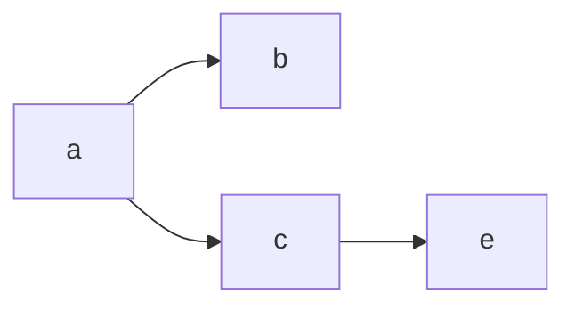
A depth first traversal would be `a,b,c,e` . Let's say that `a`, `b` and `e` are chunk boundaries. Then we have a chunk of `a,b` and `a,c,e`

The problem with this is that concurrent changes can modify the traversal. Imagine we receive some new changes which make the DAG look like this:

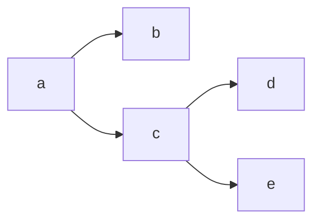
Now the traversal is `a,b,e,c,d`. This is a problem because it means that the contents of a chunk could change. Our chunks have changed to `a,b` and `a,c,d,e`. This is disastrous, two peers with the same chunk boundaries disagree on the contents of the second chunk.

Note, however, that the parents of a commit never change. This means that if we reverse the direction of the arrows and use a depth first traversal of the graph starting from the _ends_ of the chunk, then we have a stable ordering. For example, with the arrows reversed the first DAG becomes:

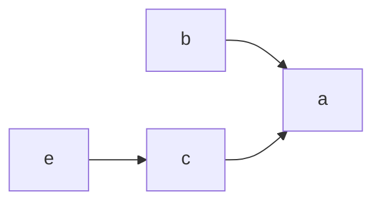

The depth first traversal of this graph, starting from `b` is `b, a` and from `d`  is `d,c,a`.  Then, after the concurrent change we have:

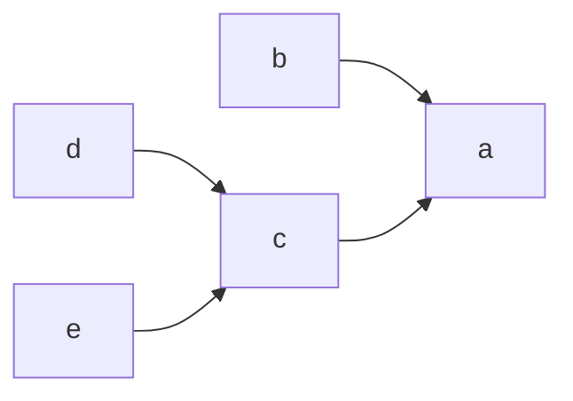

Stating from `b` we still have `b,a` and from `e` we still have `e,c,a` but now we also have `d` as a loose commit.

### Chunk Boundaries

We want a way to divide up the linear order into chunks in such a way that everyone agrees on the chunk boundaries. We also want to be able to do this recursively, so that we choose the boundaries for lower strata consistently. We can do this by interpreting the hash of each commit as a number and using the number of trailing zeros in the number as the level of the chunk boundary.

For example, if we have a commit with hash `0xbce71a3b59784f0d507fd66abeb8d95e6bb2f2d606ff159ae01f8c719b2e0000` then we can say that this is the boundary of a level 4 stratum due to the four trailing zeros. Because hashes are distributed uniformly (or else we have other problems) then the chance of any particular character in some hash being `0` is  $\frac{1}{10}$ and so the chance of having $n$ trailing zeros is $10^{-n}$ which means that we will have a hash boundary approximately every $10^{n}$ changes.

We are not forced to stick with base 10, we can interpret the hash as a number in some base $b$ and then the number of trailing zeros in that base will give us changes every $b^{n}$ changes.

### Supporting Stratum And Checkpoint Commits

A stratum $x$ supports another stratum $y$ whenever $x$ contains all the commits in $y$. It is important for sedimentree sync to be able to determine whether one stratum supports another in order to be able to determine the minimal sedimentree.

To this point I have talked about the boundaries of a stratum, but the start and an end hash is not enough to determine whether one stratum supports another without additional information. Consider this sedimentree:
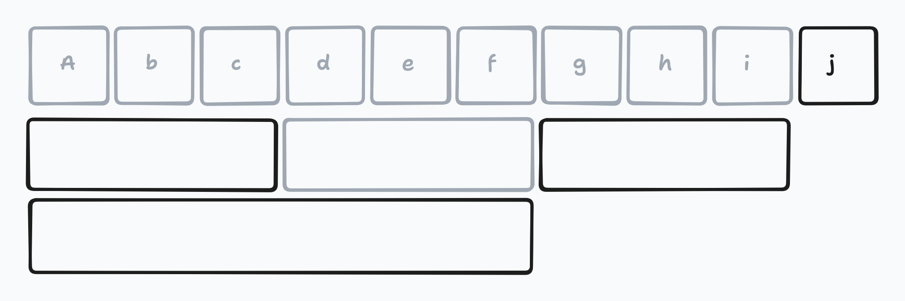
In this example the ghosted out boxes represent commits (in the case of square boxes with a letter) and stratum (in the case of rectangles) which were used to derive the non-ghosted strata but which we don't have access to (maybe we never had them, maybe we discarded them). All we know is that we have some strata, one which starts at `A` and ends at `F` (the larger one), one which starts at `A` and ends at `C`, and one which starts at `G` and ends at `I`. How can we know which of the smaller strata the large one supports?

To solve this we add the concept of "checkpoint commits". A checkpoint commit is a commit hash which would be the boundary of the smallest stratum in the system. For example, if we are producing strata for every commit that begins with two zeros then every commit hash which begins with two zeros is a checkpoint commit. We never discard checkpoint commits, which means that a stratum is now defined by it's start and end hash _and_ the checkpoint commits in it's interior.
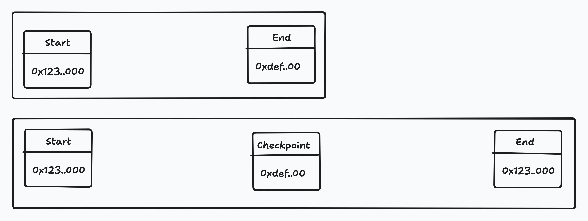
With checkpoint commits we can always determine the supporting relationship. All stratum boundaries are on checkpoint commits, so if stratum $x$ supports stratum $y$ then the start and end hashes of $y$ will be somewhere in the set (start hash of x, end hash of x, checkpoints of x).
### Loose Commits

The reverse depth first traversal ordering allows us to group commits into strata. But what do we do about commits for which we don't yet have a stratum boundary? Consider this DAG (with arrows from parents to children):

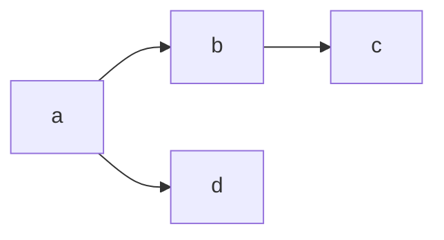

Let's say we have stratum boundaries, `a,c`. Then we have one chunk which is `c,b,a`, but `d` doesn't belong in any stratum yet because there are no stratum boundaries which are children of it. This means we must store and transmit the commit as is. However, the commit on its own is not enough because we also need to  be able to determine if, given some stratum $x$, the commit is supported by the stratum so that we can discard loose commits when we receive strata which cover them.

As with strata, just knowing the hash of a commit isn't enough to know whether it is supported by some stratum, so for loose commits we must ensure that we always retain all the commits linking the original commit back to any stratum boundaries which are it's parents.

## Syncing a Sedimentree

Sedimentree sync starts by first requesting from a remote peer a "summary" of the minimal sedimentree according to that remote. Having received this summary we will know that there are certain ranges of the tree which we do not have and how large the data representing that section is. At this point we can decide to recurse into the missing structure to see if there are smaller sections of it to download at the cost of an extra round trip, or just download the whole missing part, accepting that we might download some data we already have. Once we have completed this process we know exactly which blobs we need to download from the remote in order to be in sync and we also know what blobs we need to upload in order for them to be in sync.

#### Sedimentree Summaries

The summary contains the boundaries of the strata in the tree as well as any loose commits. Importantly the summary _does not_ contain the internal checkpoint hashes of any of the strata or any of the actual data in the strata or commits.

Omitting the checkpoint hashes is necessary because otherwise we would have to transmit all the checkpoint hashes in the document. If we use the first two leading zeros in base 10 as our strata boundary then this would mean we're sending approximately 1% of the hashes in the document every time you sync. A hash is 32 bytes and it is quite normal for a document to contain hundreds of thousands of changes, for large documents this would mean sending multiple megabytes of data just to get the sedimentree.

For loose commits we can also omit all but the end of the commit chain and a count from the summary.
