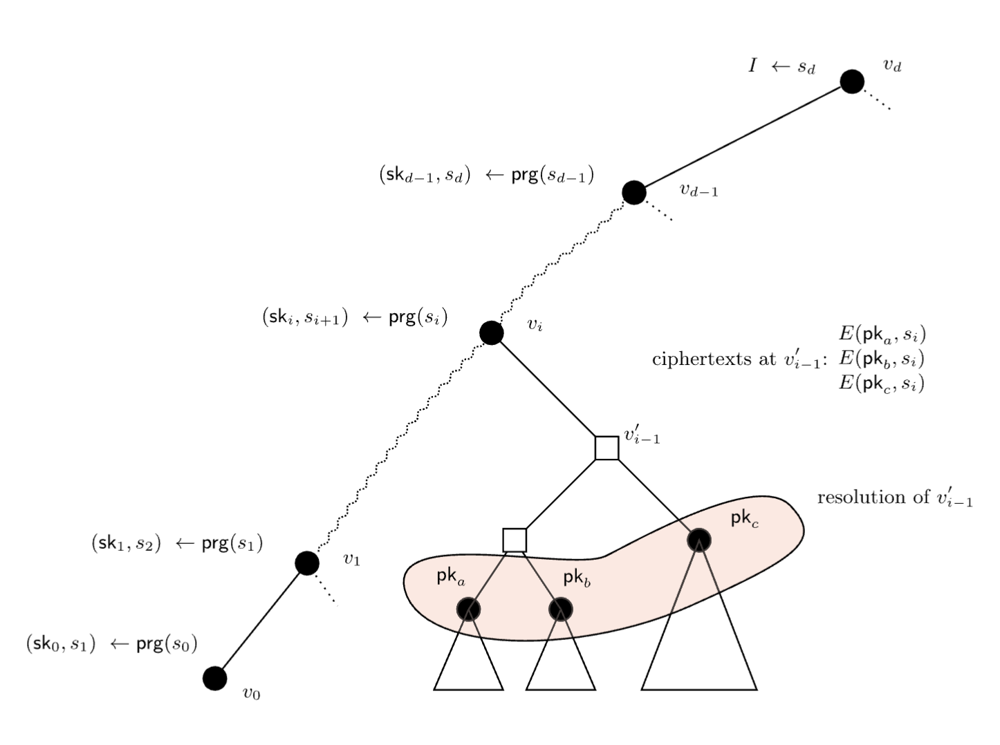
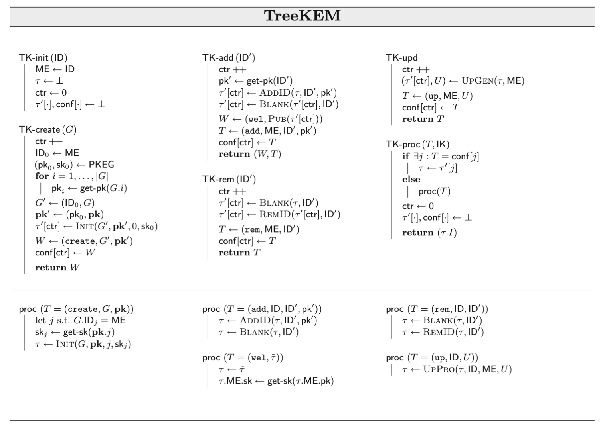

Original paper: 
[[TreeKEM - Asynchronous Decentralized Key Management for Large Dynamic Groups]]

TreeKEM is a [[Continuous Group Key Agreement]] protocol known for being the initial proposal for providing the 'core' logic of the [[Messaging Layer Security]] protocol.

```pseudocode
Node {
    left: Node | null
    right: Node | null
    secret: Secret | null
    public_key: PublicKey | null
    parent_hash: Hash | null
}
```
> [!NOTE] How each node derives all keys on the path to the root
> if I have a secret key for my leaf node, i've broadcast a public DH key derived from that secret, and i have the public key of my binary tree sibling, then together we can generate a shared secret for our parent and derive a public key from that, which we can broadcast. then using the PK for that node's sibling, we can derive the grandparent's secret key, all the way up to the root node secret. also explained [[02 · Group Key Agreement with BeeKEM|here]]

> [!question]
> how does each node know its position in the tree?

TreeKEM "continuously generates fresh, shared, and secret randomness used by the participating parties ==to evolve the group key material==. ==Each new group key is used to initiate a fresh symmetric hash ratchet that defines a stream of nonce/key pairs to symmetrically encrypt/decrypt higher level application messages== (such as texts in a chat) using an AEAD. A stream is used until the next evolution of the group key at which point a new stream is initiated." [[Security Analysis and Improvements for the IETF MLS Standard for Group Messaging|Alwen et al.]] p.250

See also
[[Asynchronous ratcheting tree]]


> [!Question]
>how/when did the [[#Problems|issues]] with [[TreeKEM]] get resolved - seems like definitely better by draft 11?


### When does the group key 'evolve'?

Every change to any key will also mean a change to its parents key, up to and including the root key. So the root key is changed most often.

| **Situation**                  | **Recipients**                            | **What’s Sent**                                                          |
| ------------------------------ | ----------------------------------------- | ------------------------------------------------------------------------ |
| **Group Creation**             | None                                      | No communication is needed.                                              |
| **Adding a New Member**        | Existing members + new member             | Path secrets (encrypted) and synchronisation data for the new member.    |
| **Removing a Member**          | Remaining members                         | Updated path secrets (encrypted).                                        |
| **Key Update**                 | All other members                         | Updated path secrets (encrypted).                                        |
| **Group Merging**              | All members of both groups                | New tree structure and secrets (encrypted).                              |
| **Splitting a Group**          | Members of the new subgroup               | Updated tree structure and path secrets (encrypted).                     |
| **Membership Change + Update** | Remaining members + new member (if added) | Combined updates reflecting both membership and key updates (encrypted). |
| **Group Termination**          | Optional notification (all members)       | Informational message; no cryptographic updates required.                |
### **Efficiency Considerations**
- **Path Updates**: Updates are localised to the path from the affected leaf to the root, making TreeKEM efficient with $O(\log n)$ complexity.
- **Communication Overhead**: The number of messages scales with the group size n, but each message size is small due to encrypting only the path secrets for each member.


## Problems

Issues with [[Forward secrecy]] "stemming from the fact that its users do not erase old keys sufficiently fast." [[Security Analysis and Improvements for the IETF MLS Standard for Group Messaging|Alwen et al.]] p.251


[[Security Analysis and Improvements for the IETF MLS Standard for Group Messaging]]:
## 4 TreeKEM
### 4.1 Overview
> The TreeKEM [[Continuous Group Key Agreement|CGKA]] protocol is based on so-called (binary) *ratchet trees* (RTs). In a TreeKEM RT, group members are arranged at the leaves, and all nodes have an associated public-key encryption (PKE) key pair, except for the root. The tree invariant is that ==each user knows all secret keys on their *direct path*, i.e., on the path from their leaf node to the root==. In order to perform ==an update—the most crucial operation of a CGKA==—and produce a new update secret I, a party first generates fresh key pairs on every node of their direct path. Then, for every node v′ on its co-path—the sequence of siblings of nodes on the direct path—it encrypts specific information under the public key of v′ that allows each party in the subtree of v′ to learn all new secret keys from v’s parent up to the root (cf. Fig. 3 and Sect. 4.4). Before presenting the formal description of TreeKEM in Sect. 4.4, basic concepts around ratchet trees are explored in Sect. 4.3. Moreover, Sect. 4.2 quickly discusses the simple PKI model used in this work. 
>
> Fig. 3. An **update** operation initiated by the party at leaf $v_0$. First, a random “seed value” $s_0$ is chosen. Thereafter, a PRG is applied iteratively at every level i of v0’s direct path in order to derive (i) a PKE secret key $sk_i$ for that level (from which a public key can be computed using the key generation algorithm) and (ii) a seed $s_{i+1}$ for the next level. ==Every seed $s_i$ is encrypted using the public key of the corresponding co-path node $v^′_{i−1}$.== *what is done with the encrypted seed?* Sometimes, such a node can be blank, in which case $s_i$ must be encrypted using the public keys of each node in the resolution, which is the smallest set of nodes covering all leaves in the subtree of $v^′_{i−1}$ This ensures that all these nodes are able to compute the keys from $v_i$ upward. The update secret I produced by such an update is the seed value $s_d$ at the root.
>
### 4.2 PKI 
> The ==TreeKEM protocol requires a public-key infrastructure (PKI)== where parties can register **ephemeral keys**. The MLS documents [5,29] lay out explicitly how users are to generate, authenticate, distribute, and verify each others initialization keys. For simplicity and in order not to detract from the essential components of TreeKEM, this work models the PKI by providing protocol algorithms and attackers with access to the following PKI functionality: (1) Any user ID may request a fresh (encryption) public key pertaining to some other user ID′. That is, when ID calls get-pk(ID′), the PKI functionality generates a fresh key pair (pk, sk) and returns pk to ID. The PKI also records the triple (pk, sk, ID′) and passes the information (pk, ID′) to the attacker. (2) Any user ID′ may request secret keys corresponding to public keys associated with them.
>
> Specifically, when ID′ calls get-sk(pk), if a triple (pk, sk, ID′) is recorded, the PKI functionality returns sk to ID′. Note in particular that the PKI ensures that every public key is only used once. Of course, in practice such a PKI functional- ity would actually be implemented by having users generate key pairs themselves and registering them with the PKI. However, the above formalization simplifies the description of the protocols.
> 
> 
> **Fig. 4.** The TreeKEM protocol operations. The functions AddID, RemID, and Blank are defined in Sect. 4.3, while UpGen and UpPro are defined in Sect. 4.4.
> 
### 4.3 Ratchet Trees  
> **Basics.** The following are some basic concepts around TreeKEMs ratchet trees.
> 
> *LBBTs.* An RT in TreeKEM is a so-called left-balanced binary tree (LBBT). In a nutshell, an LBBT on n nodes (is defined recursively and) has a maximal full binary tree as its left child and an LBBT on the remaining nodes as its right child:
> 
> **Definition 3 (Left-Balanced Binary Tree).** For n ∈ N the left-balanced binary tree (LBBT) on n nodes $LBBT_n$ is the binary tree constructed as follows: The tree $LBBT_1$ is a single node. Let x = mp2(n).\* Then, the root of $LBBT_n$ has the full subtree $FT_x$ as the left subtree and $LBBT_{n−x}$ as the right subtree.
> 
> 	\*Recall that mp2(n) is the maximum power of two dividing n.
> 
> 	So, $LBBT_1$ is a single node, $LBBT_2$ has $FT_x$ as the left subtree which is just one node (x = mp2(2) = 1?). n is the number of leaves so 
> 	
> 
> Observe that $LBBT_n$ ==has exactly n leaves== and that ==every internal node has two children==. In an RT, nodes are labeled as follows: 
> 	*Root*: The root is labeled by an update secret I. 
> 	*Internal nodes*: Internal nodes are labeled by a key pair (pk, sk) for the PKE scheme Π. 
> 	*Leaf nodes*: Leaf nodes are labeled like internal nodes, except that they additionally have an owner ID. 
> 
> Labels are referred to using dot-notation (e.g., v.pk is v’s public key). As a shorthand, τ.ID is the leaf node with label ID. ==Any subset of a node’s labels may be undefined, which is indicated by the special symbol ⊥==. Furthermore, ==a node v may be blank==. A blank node has all of its labels set to ⊥. As explained below, ==all internal nodes in a freshly initialized RT are blank==, and, moreover, blanks can result from adding and removing users to and from a group, respectively. 
> 
> *Paths and blanking.* As hinted at the beginning of this section, it will be useful to consider the following types of paths: ==the direct path dPath(τ, ID), which is the path from the leaf node labeled by ID to the root==; the ==co-path coPath(τ, ID)==, which is the sequence of siblings of nodes on the direct path dPath(τ, ID). Furthermore, given an ID $ID$ and an RT τ , ==the function τ ′ ← Blank(τ, ID) blanks all nodes on dPath(τ, ID)==. 
> 
> *Resolutions and representatives.* A crucial notion in TreeKEM is that of a ==resolution==. Intuitively, the ==resolution of a node v is the smallest set of non-blank nodes that covers all leaves in v’s subtree==. 
> 
> **Definition 4 (Resolution).** Let τ be a tree with node set V . The resolution $Res(v) ⊆ V$ of a node $v ∈ V$ is defined recursively as follows: If v is not blank, then $Res(v) = \{v\}$, else if v is a blank leaf, then $Res(v) = \emptyset$, otherwise, Res(v) := $∪_{v^′∈C(v)}$ $Res(v^′)$, where C(v) are the children of v. 
> 
> Each leaf $\ell^′$ in the subtree τ ′ of some node v′ has a representative in τ ′: 
> 
> **Definition 5 (Representative).** Consider a tree τ and two leaf nodes $\ell$ and $\ell^′$. 
> 1. Assume $\ell^′$ is non-blank and in the subtree rooted at v′. The representative Rep(v′, $\ell^′$) of $\ell^′$ in the subtree of v′ is the first filled node on the path from v′ (down) to $\ell$. 
> 2. Consider the least common ancestor w = LCA($\ell, \ell^′$) of $\ell$ and $\ell^′$. Let v be the child of w on the direct path of $\ell$, and v′ that on the direct path of $\ell^′$. The representative Rep($\ell, \ell^′$) of $\ell^′$ w.r.t. $\ell$ is defined to be the representative Rep(v′, $\ell^′$) of $\ell^′$ in the subtree of v′. 
> 
 >It is easily seen that Rep(v′, $\ell^′$) ∈ Res(v′). 
> 
> **Simple RT operations.** The following paragraphs describe how RTs are initialized as well as how they grow and shrink. The proofs of Lemmas 1 and 2 below can be found in the full version [3]
> 
> *RT initialization.* Given lists of users $G = (ID_0, ID_1, . . . , ID_n)$ and public keys $pk = (pk_0, pk_1, . . . , pk_n)$ as well as an integer j and a secret key $sk_j$ , a new RT is initialized as the left-balanced binary tree $LBBT_{n+1}$ where all the internal nodes as well as the root are blanked, the label of every leaf i is set to $(ID_i, pk_i, ⊥)$ ==*remember ⊥ means blank/undefined*==, and the secret key at leaf j is additionally set to $sk_j$ . In the following, the above operation is denoted by Init(G, pk, j, $sk_j$). 
> 
> *Adding IDs to the RT.* Given an RT τ , the procedure τ′ ← AddID(τ, ID, pk), sets the labels of the first blank leaf of τ to (ID, pk, ⊥), and outputs the resulting tree, τ′. If there is no blank leaf in the tree $τ = LBBT_n$, method AddLeaf(τ) is called, which adds a leaf z to it, resulting in a new tree τ ′ = AddLeaf(τ): If n is a power of 2, create a new node r′ for τ ′. Attach the root of τ as its left child and z as its right child. Otherwise, let r be the root of τ , and let τL and $τ_R$ be r’s left and right subtrees, respectively. Recursively insert z into τR to obtain a new tree $τ^′_R$, and let τ ′ be the tree with r as a root, $τ_L$ as its left subtree and $τ^′_R$ as its right subtree. 
> 
> **Lemma 1.** If $τ = LBBT_n$, then $τ^′ = LBBT_{n+1}$. 
> 
> *Removing an ID.* The procedure τ ′ ← RemID(τ, ID) blanks the leaf labeled with ID and truncates the tree such that the rightmost non-blank leaf is the last node of the tree. Specifically, the following recursive procedure Trunc(v) is called on the rightmost leaf v of τ , resulting in a new tree τ ′ ← Trunc(τ):* If v is blank and not the root, remove v as well as its parent and place its sibling v′ where the parent was. Then, execute Trunc(v′). If v is non-blank and the root, execute Trunc(v′′) on the rightmost leaf node in the tree. Otherwise, do nothing. 
> 
> 	\* Overloading function Trunc for convenience here.
> 
> **Lemma 2.** If $τ = LBBT_n$, then $τ^′ = LBBT_y$ for some 0 < y ≤ n. Furthermore, unless y = 1, the rightmost leaf of τ′ is non-blank. 
> 
> *Public copy of an RT.* Given an RT τ , τ ′ ← Pub(τ) creates a public copy, τ ′, of the RT by setting all secret-key labels to ⊥.
> 
> **4.4 TreeKEM Protocol** 
> 
> This section now explains the TreeKEM protocol in detail by describing all the algorithms involved in the scheme, which is depicted in Fig. 4. For simplicity, the state γ is not made explicit; ==it consists of the variables initialized by init==. TreeKEM makes (black-box) use of the following cryptographic primitives: a pseudo random generator PRG, and a CPA-secure public-key encryption scheme Π = (PKEG, Enc, Dec). TreeKEM as described here is slightly different from TreeKEM as described in the current MLS draft [5]. These differences are elaborated on in the full version [3]. Essentially, they are small efficiency improvements that do not affect security.
> 
> **Initialization.** The initialization procedure **TK-init** expects as input an ID $ID$ and initializes several state variables: Variable $ME$ remembers the ID of the party running the scheme and τ will keep track of the RT used. The other variables are used to keep track of all the operations (creates, adds, removes, and updates) initiated by ME but not confirmed yet by the server. Specifically, each time a party performs a new operation, it increases ctr and stores the potential next state in τ′[ctr]. Moreover, conf[ctr] will store the control message the party expects from the server as confirmation that the operation was accepted. These variables are reset each time proc processes a control message (which can either be one of the messages in conf or a message sent by another party). 
> 
> **Group creation.** Given lists of users $G = (ID_1, . . . , ID_n)$, **TK-create** initializes a new ratchet tree by first creating a new PKE key pair $(pk_0, sk_0)$, fetching public keys $pk = (pk_1, . . . , pk_n)$ corresponding to the IDs in G from the PKI, and then calling **Init** with G′ = ($ID_0$, G) and pk′ = ($pk_0$, pk) as well as 0 and $sk_0$. The welcome message simply consists of G′ and pk′. 
> 
> **Adding a group member.** To add new group member ID′, add first obtains a corresponding public key pk′ from the PKI and then updates the RT by calling **AddID** (described above) followed by **Blank**, which removes all keys from the new party’s leaf up to the root. This ensures that the new user does not know any secret keys used by the other group members before he joined. The welcome message for the new user simply consists of a public copy of the current RT (specifically, **Pub** sets the sender’s secret-key label to ⊥), and the control message for the remaining group members of the IDs of the sender and the new user as well as the latter’s public key. 
> 
> **Removing a group member.** A group member ID′ is removed by first blanking all the keys from the leaf node of ID′ to the root. This prevents parties from using keys known to ID′ in the future. User ID′ is subsequently removed from the tree by calling **RemID**. The control message for the remaining group members consists of the IDs of the sender and the removed user. 
> 
> **Performing an update.** A user ME performs an update by choosing new key pairs on their direct path as follows: 
> - Compute path secrets: Let $v_0 = v, v_1, . . . , v_d$, be the nodes on the direct path of the ME’s leaf node v. First, ME chooses a uniformly random s0. Then, they compute $sk_i‖s_{i+1} ← PRG(si)$, for i = 0, . . . , d − 1. 
> - Update RT labels: For i = 0, . . . , d − 1, ME computes $pk_i$ ← PKEG($sk_i$) and updates the PKE label of $v_i$ to $(pk_i, sk_i)$. 
> - Root node: For the root node, ME sets I := sd
> 
> The above operation is denoted by τ ′ ← **PropUp**(τ, v, s0). Having computed the new keys on its direct path, ME proceeds as follows: 
> 
> - *Encrypt path secrets:* Let $v^′_0, . . . , v^′_{d−1}$ be the nodes on the co-path of v (i.e., $v^′_i$ is the sibling of $v_i$). For every value $s_i$ and every node $v_j ∈ Res(v^′_{i−1})$, ME computes $c_{ij} ← Enc(v_j .pk, s_i)$. 
> - *Output:* All ciphertexts $c_{ij}$ are concatenated to an overall ciphertext c (in some canonical order10). Let U ← (PK, c), where $PK := (pk_0, . . . , pk_{d−1})$ be the update information for the remaining group members. 
> 
> The entire update process described above is denoted by (τ ′, U ) ← UpGen(τ, ID). The control message for this operation simply consists of ME’s ID and U . 
> 
> *Notation.* It will also be convenient to refer to the set of secret keys $\text{RecKeys}(si) := {sk_i, . . . , sk_{d−1}, s_d}$ that can be recovered from path secret $s_i$. Moreover, let $\text{PKeys}(s_i) := \{s_k | s_i\text{ is encrypted under PK corresponding to }s_k\}$ be the set of secret keys such that $s_i$ is encrypted under the corresponding public keys. 
> 
> **Processing control messages.** When processing a control message T , a user first checks whether T corresponds to an operation they initiated. If so, they simply adopt the corresponding RT in τ ′[·]. 
> Whenever T was sent from another user, depending on the type of the control message, proc operates as follows: 
>- T = (create, G, pk): In this case, simply determine the position j of ME in the G list, retrieve the appropriate secret key skj from the PKI, and initialize the RT via τ ← Init(G, pk, j, skj ). 
>- W = (wel, ˜τ ): Simply adopt ˜τ as the current RT τ and set the secret key at ME’s node to the key get-sk(τ.ME.pk) retrieved from the PKI. 
>- T = (add, ID, ID′, pk′): Add the new user ID′ to the RT and blank all nodes in the direct path of the new user. 
>- T = (rem, ID, ID′): Blank all nodes on the direct path of user ID′ and remove ID′ from the RT. 
>- T = (up, ID, U ): A user ID′ at some leaf ′ receiving U = (PK, c), issued by the user with id ID at leaf v, recovers the update information as follows: Let w := Rep(v, ′). The user with ID′, uses w.sk to decrypt cij (for the appropriate j) and obtain si. Finally, update the ratchet tree by overriding the public-key labels on the v-root-path by the keys in PK, and by then producing a new tree τ ′ ← PropUp(τ, LCA(v, ′), si). The entire process just described is denoted by τ ′ ← UpPro(τ, ID, ID′, U ). 
>
>Irrespective of whether T was created by ME or another user, after processing it, TK-proc resets the variables pertaining to keeping track of ME’s unconfirmed operations.
>[[Security Analysis and Improvements for the IETF MLS Standard for Group Messaging]] pp.260-266


# TreeKEM as a composition of simpler functions

**TreeKEM** (Tree Key Establishment Mechanism), the key exchange protocol at the heart of [MLS (Message Layer Security)](https://datatracker.ietf.org/doc/html/rfc9420), can be described as a **composition of simpler functions and ideas**, both cryptographic and structural:

### 🔧 TreeKEM = (Binary Tree Structure) + (Diffie-Hellman Key Exchanges) + (Key Derivation)

### 1. **Binary Tree Structure**

- Members of the group are leaves in a binary tree.
- Each node in the tree (internal or leaf) holds a **secret**, and the group secret is derived from the root.
- Each member stores secrets for nodes along their direct path to the root.
### 2. **Diffie-Hellman (DH) at Each Node**

- Internal nodes derive their secret from a **DH operation** between their children.
- The standard DH or HPKE (Hybrid Public Key Encryption) operation is applied:  
    `secret_parent = KDF(DH(pubL, privR))`  
    where `pubL` and `privR` are public/private key pairs from the left and right child.
### 3. **Update / Join = Reblinding Subtree**

- When someone updates their key or a new member joins:
    - They generate a new leaf secret.
    - Then recursively recompute secrets up to the root by replacing (and reblinding) their direct path.
    - This requires publishing **UpdatePath**, which includes new public keys along the direct path and encryptions of node secrets to sibling nodes.
### 4. **Key Derivation = TreeKDF**

- Secrets at each node are not used directly — instead, TreeKEM uses a **KDF tree** to derive:
    - The group encryption key
    - Welcome secrets
    - Message secrets (through a secret tree)
### 5. **Encryption = HPKE Composition**

- TreeKEM composes with **HPKE** for:
    - Encrypting path secrets
    - Welcome messages for new members
### 6. **Authentication = Parent Hashes**

- Every internal node includes a **parent hash** (a hash of its children's secrets), ensuring the integrity of the tree structure and preventing equivocation.
### Summary:

TreeKEM is a **compositional protocol** built from:

- **Tree structure** for scalability
- **Diffie-Hellman key agreement** for security
- **KDFs** for key derivation
- **HPKE** for authenticated encryption
- **Hashes** for integrity and authentication

This modularity is part of what makes TreeKEM elegant and efficient.

## Pseudocode

### 🔐 Primitives

```pseudocode
GenerateKeyPair() -> (sk, pk)
DH(sk, pk_other) -> shared_secret
KDF(secret, label) -> derived_key
HPKE_Encrypt(pk, plaintext) -> ciphertext
HPKE_Decrypt(sk, ciphertext) -> plaintext
Hash(data) -> digest
```

### 🌲 Tree Structure

```pseudocode
Node {
    left: Node | null
    right: Node | null
    secret: Secret | null
    public_key: PublicKey | null
    parent_hash: Hash | null
}
```

Each **leaf node** corresponds to a group member. Each **internal node** has a DH key pair and is derived from its children.

### 🔁 Key Derivation in Tree

```pseudocode
DeriveParentSecret(left_node, right_node):
    dh_shared = DH(left_node.secret, right_node.public_key)
    return KDF(dh_shared, "node secret")

BuildTreeSecrets(node):
    if node is leaf:
        node.secret = GenerateKeyPair().sk
    else:
        BuildTreeSecrets(node.left)
        BuildTreeSecrets(node.right)
        node.secret = DeriveParentSecret(node.left, node.right)
        node.public_key = GenerateKeyPairFromSecret(node.secret)
        node.parent_hash = Hash(node.left.public_key || node.right.public_key)
```

---

### 🔄 UpdatePath Generation

```pseudocode
GenerateUpdatePath(updating_leaf):
    new_path = []
    node = updating_leaf
    while node != root:
        sibling = node.get_sibling()
        parent = node.get_parent()

        # New secret for this parent
        new_secret = GenerateKeyPair().sk
        new_public = GenerateKeyPairFromSecret(new_secret)

        encrypted_secrets = []
        for recipient in sibling.copath_leaves():
            ciphertext = HPKE_Encrypt(recipient.public_key, new_secret)
            encrypted_secrets.append((recipient.id, ciphertext))

        new_path.append({
            node_id: parent.id,
            public_key: new_public,
            encrypted_secrets: encrypted_secrets
        })

        node = parent
    return new_path
```

---

### 🧩 Applying an UpdatePath

```pseudocode
ApplyUpdatePath(receiver_leaf, update_path):
    for entry in update_path:
        if receiver_leaf in copath(entry.node_id):
            ciphertext = entry.encrypted_secrets[receiver_leaf.id]
            secret = HPKE_Decrypt(receiver_leaf.secret, ciphertext)
            RecomputeSubtree(entry.node_id, secret)
```

---

### 🔑 Group Key Derivation

```pseudocode
ComputeGroupKey(root_node):
    return KDF(root_node.secret, "group key")
```

---

### 📦 Welcome Message for New Members

```pseudocode
GenerateWelcome(new_member, tree_root):
    path_secret = ... # from leaf to root
    welcome_secret = KDF(path_secret, "welcome")
    encrypted_welcome = HPKE_Encrypt(new_member.public_key, welcome_secret)
    return encrypted_welcome
```

---

This pseudocode shows TreeKEM as a **functional composition** of:

- Key pair generation
- DH key agreement
- KDFs
- HPKE encryption
- Tree traversal

Each component is relatively simple, but their orchestration enables efficient and secure group key agreement. Let me know if you want a specific aspect implemented in real code (e.g. Rust, Python, or TypeScript).